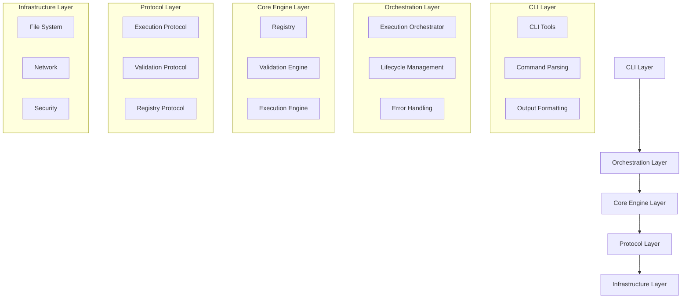
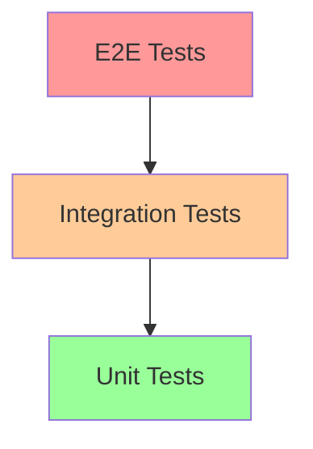

<!-- === OmniNode:Metadata ===
metadata_version: 0.1.0
protocol_version: 1.1.0
owner: OmniNode Team
copyright: OmniNode Team
schema_version: 1.1.0
name: architectural_scrutiny.md
version: 1.0.0
uuid: 3cefad36-f9cc-4d59-8b3c-0563cd1d90f3
author: OmniNode Team
created_at: 2025-05-27T07:05:02.341376
last_modified_at: 2025-05-27T17:26:51.901085
description: Stamped by ONEX
state_contract: state_contract://default
lifecycle: active
hash: 0eb50be26fe2bd3e92a544a9eea7fddca981c5ccabe29cf3fc44d8b35b510e6d
entrypoint: python@architectural_scrutiny.md
runtime_language_hint: python>=3.11
namespace: onex.stamped.architectural_scrutiny
meta_type: tool
<!-- === /OmniNode:Metadata === -->


# ONEX Architectural Scrutiny

> **Status:** Canonical  
> **Last Updated:** 2025-05-27  
> **Purpose:** Provide comprehensive architectural analysis, design decisions, trade-offs, and scrutiny of the ONEX platform  
> **Audience:** Architects, senior engineers, technical leads, and system designers  
> **Scope:** Platform-wide architectural patterns, decisions, and their implications

---

## Overview

This document provides a critical analysis of the ONEX platform architecture, examining design decisions, trade-offs, architectural patterns, and their implications for scalability, maintainability, and performance. It serves as both a reference for understanding architectural choices and a guide for future architectural decisions.

---

## Architectural Principles

### Core Design Principles

#### 1. Protocol-First Architecture
**Decision**: Use Protocol classes instead of Abstract Base Classes (ABCs) for defining interfaces.

**Rationale**:
- Structural typing provides more flexibility than nominal typing
- Easier testing with duck typing
- Better compatibility with dependency injection
- Reduced coupling between components

**Trade-offs**:
- ✅ **Pros**: Flexibility, testability, loose coupling
- ❌ **Cons**: Less explicit inheritance relationships, potential runtime errors

**Implementation**:
```python
from typing import Protocol

class ExecutionProtocol(Protocol):
    def execute(self, context: ExecutionContext) -> Result:
        """Execute with given context."""
        ...

class ValidationProtocol(Protocol):
    def validate(self, artifact: Artifact) -> ValidationResult:
        """Validate artifact."""
        ...
```

#### 2. Registry-Driven Discovery
**Decision**: Centralized registry for node discovery and version resolution.

**Rationale**:
- Single source of truth for available nodes
- Automatic version resolution
- Dependency tracking and validation
- Simplified node management

**Trade-offs**:
- ✅ **Pros**: Centralized management, automatic discovery, version control
- ❌ **Cons**: Single point of failure, potential performance bottleneck

**Mitigation Strategies**:
- Registry caching and replication
- Fallback discovery mechanisms
- Performance monitoring and optimization

#### 3. Capability-Based Security
**Decision**: Use capability-based security model for execution contexts.

**Rationale**:
- Fine-grained access control
- Principle of least privilege
- Composable security policies
- Clear security boundaries

**Trade-offs**:
- ✅ **Pros**: Fine-grained control, composability, clear boundaries
- ❌ **Cons**: Complexity in capability management, potential performance overhead

---

## System Architecture Analysis

### Layered Architecture



#### Layer Responsibilities

| Layer | Responsibilities | Key Components |
|-------|------------------|----------------|
| **CLI** | User interface, command parsing, output formatting | `cli_main.py`, command handlers |
| **Orchestration** | Workflow coordination, lifecycle management | Orchestrators, lifecycle managers |
| **Core Engine** | Business logic, node execution, validation | Registry, execution engine, validators |
| **Protocol** | Interface definitions, contracts | Protocol classes, type definitions |
| **Infrastructure** | System services, I/O, security | File handlers, network, security services |

### Component Interaction Patterns

#### 1. Registry Pattern
**Purpose**: Centralized component discovery and management.

**Implementation**:
```python
class Registry:
    def __init__(self):
        self._nodes: Dict[str, NodeMetadata] = {}
        self._cache: Dict[str, Any] = {}
    
    def register_node(self, metadata: NodeMetadata) -> None:
        """Register node with metadata."""
        self._nodes[metadata.uuid] = metadata
    
    def discover_nodes(self, criteria: DiscoveryCriteria) -> List[NodeMetadata]:
        """Discover nodes matching criteria."""
        return [node for node in self._nodes.values() 
                if self._matches_criteria(node, criteria)]
```

**Strengths**:
- Centralized management
- Automatic discovery
- Version resolution
- Dependency tracking

**Weaknesses**:
- Potential bottleneck
- Single point of failure
- Memory usage for large registries

#### 2. Execution Context Pattern
**Purpose**: Provide secure, controlled execution environment.

**Implementation**:
```python
@dataclass
class ExecutionContext:
    capabilities: List[Capability]
    environment: Dict[str, str]
    working_directory: Path
    timeout: Optional[int] = None
    
    def check_capability(self, required: Capability) -> bool:
        """Check if context has required capability."""
        return required in self.capabilities
```

**Strengths**:
- Security isolation
- Resource control
- Clear boundaries
- Composable capabilities

**Weaknesses**:
- Complexity in capability management
- Performance overhead
- Potential for capability conflicts

#### 3. Protocol-Based Dependency Injection
**Purpose**: Loose coupling through protocol-based interfaces.

**Implementation**:
```python
class NodeExecutor:
    def __init__(
        self,
        registry: RegistryProtocol,
        validator: ValidationProtocol,
        security: SecurityProtocol
    ):
        self.registry = registry
        self.validator = validator
        self.security = security
```

**Strengths**:
- Loose coupling
- Easy testing
- Flexible implementations
- Clear dependencies

**Weaknesses**:
- Runtime type checking
- Potential for interface drift
- Complexity in large systems

---

## Performance Architecture

### Caching Strategy

#### Multi-Level Caching
```yaml
caching_levels:
  l1_memory:
    type: "in-process"
    size: "100MB"
    ttl: "5m"
    use_cases: ["node metadata", "validation results"]
  
  l2_redis:
    type: "distributed"
    size: "1GB"
    ttl: "1h"
    use_cases: ["registry data", "execution results"]
  
  l3_filesystem:
    type: "persistent"
    size: "10GB"
    ttl: "24h"
    use_cases: ["node artifacts", "large datasets"]
```

#### Cache Invalidation Strategy
- **Time-based**: TTL for different data types
- **Event-based**: Invalidate on registry updates
- **Version-based**: Cache keys include version information
- **Dependency-based**: Invalidate dependent caches

### Concurrency Model

#### Execution Concurrency
```python
class ConcurrentExecutor:
    def __init__(self, max_workers: int = 10):
        self.executor = ThreadPoolExecutor(max_workers=max_workers)
        self.semaphore = Semaphore(max_workers)
    
    async def execute_node(self, node: Node, context: ExecutionContext) -> Result:
        """Execute node with concurrency control."""
        async with self.semaphore:
            return await self.executor.submit(node.execute, context)
```

**Concurrency Patterns**:
- **Thread Pool**: For I/O-bound operations
- **Process Pool**: For CPU-bound operations
- **Async/Await**: For network operations
- **Semaphores**: For resource limiting

### Scalability Considerations

#### Horizontal Scaling
- **Stateless Design**: All components designed to be stateless
- **Load Balancing**: Support for multiple instances
- **Distributed Registry**: Registry can be distributed across nodes
- **Microservice Ready**: Components can be deployed independently

#### Vertical Scaling
- **Resource Limits**: Configurable resource limits per node
- **Memory Management**: Efficient memory usage patterns
- **CPU Optimization**: Optimized algorithms and data structures
- **I/O Optimization**: Efficient file and network operations

---

## Security Architecture

### Security Layers

#### 1. Network Security
- **TLS/mTLS**: All network communication encrypted
- **Network Policies**: Restricted network access
- **Firewall Rules**: Port and protocol restrictions
- **VPN/Private Networks**: Isolated network segments

#### 2. Authentication & Authorization
- **Multi-factor Authentication**: Required for sensitive operations
- **Role-Based Access Control**: Hierarchical permission system
- **Capability-Based Security**: Fine-grained access control
- **Token-Based Authentication**: JWT tokens with expiration

#### 3. Execution Security
- **Sandboxing**: Isolated execution environments
- **Resource Limits**: CPU, memory, and I/O constraints
- **Input Validation**: Comprehensive input sanitization
- **Output Filtering**: Sensitive data filtering

#### 4. Data Security
- **Encryption at Rest**: All stored data encrypted
- **Encryption in Transit**: All network data encrypted
- **Key Management**: Secure key storage and rotation
- **Data Classification**: Sensitivity-based handling

### Security Trade-offs

#### Performance vs Security
- **Encryption Overhead**: 5-10% performance impact
- **Validation Overhead**: 2-5% performance impact
- **Sandboxing Overhead**: 10-20% performance impact
- **Audit Logging**: 1-3% performance impact

**Mitigation Strategies**:
- Hardware acceleration for encryption
- Optimized validation algorithms
- Efficient sandboxing technologies
- Asynchronous audit logging

---

## Data Architecture

### Data Flow Patterns

#### 1. Command-Query Responsibility Segregation (CQRS)
```python
class NodeRegistry:
    def __init__(self):
        self.command_store = CommandStore()
        self.query_store = QueryStore()
    
    def register_node(self, metadata: NodeMetadata) -> None:
        """Command: Register new node."""
        self.command_store.store_command(RegisterNodeCommand(metadata))
        self.query_store.update_node_index(metadata)
    
    def find_nodes(self, criteria: SearchCriteria) -> List[NodeMetadata]:
        """Query: Find nodes matching criteria."""
        return self.query_store.search(criteria)
```

**Benefits**:
- Optimized read and write operations
- Scalable query performance
- Clear separation of concerns
- Audit trail for all changes

#### 2. Event Sourcing
```python
class EventStore:
    def append_event(self, event: Event) -> None:
        """Append event to store."""
        self.events.append(event)
        self.notify_subscribers(event)
    
    def replay_events(self, from_version: int) -> Iterator[Event]:
        """Replay events from specific version."""
        return iter(self.events[from_version:])
```

**Benefits**:
- Complete audit trail
- Time-travel debugging
- Event-driven architecture
- Eventual consistency support

### Data Consistency

#### Consistency Models
- **Strong Consistency**: For critical registry operations
- **Eventual Consistency**: For distributed caches
- **Causal Consistency**: For related operations
- **Session Consistency**: For user interactions

#### Conflict Resolution
- **Last-Writer-Wins**: For simple conflicts
- **Vector Clocks**: For complex distributed scenarios
- **Operational Transform**: For collaborative editing
- **Manual Resolution**: For critical conflicts

---

## Error Handling Architecture

### Error Taxonomy

#### Error Categories
```python
class ErrorCategory(Enum):
    SCHEMA = "SC"           # Schema validation errors
    LIFECYCLE = "LC"        # Lifecycle management errors
    METADATA = "MD"         # Metadata validation errors
    FILESYSTEM = "FS"       # File system errors
    REGISTRY = "RG"         # Registry operation errors
    SECURITY = "ST"         # Security and authentication errors
    TESTING = "TS"          # Testing framework errors
    CLI = "CI"              # CLI interface errors
    NETWORK = "NE"          # Network and communication errors
```

#### Error Handling Patterns
- **Circuit Breaker**: Prevent cascade failures
- **Retry with Backoff**: Handle transient failures
- **Bulkhead**: Isolate failure domains
- **Timeout**: Prevent hanging operations

### Observability Architecture

#### Monitoring Stack
```yaml
monitoring_stack:
  metrics:
    - prometheus
    - grafana
    - custom_metrics
  
  logging:
    - structured_logging
    - centralized_aggregation
    - log_correlation
  
  tracing:
    - distributed_tracing
    - request_correlation
    - performance_profiling
  
  alerting:
    - threshold_based
    - anomaly_detection
    - escalation_policies
```

---

## Testing Architecture

### Testing Strategy

#### Test Pyramid


#### Testing Patterns
- **Protocol-Based Testing**: Test against protocols, not implementations
- **Fixture Injection**: Centralized test data management
- **Property-Based Testing**: Generate test cases automatically
- **Contract Testing**: Verify interface contracts

#### Test Categories
```python
class TestCategory(Enum):
    UNIT = "unit"                    # Individual component tests
    INTEGRATION = "integration"      # Component interaction tests
    CONTRACT = "contract"            # Interface contract tests
    PERFORMANCE = "performance"      # Performance and load tests
    SECURITY = "security"           # Security vulnerability tests
    ACCEPTANCE = "acceptance"       # User acceptance tests
```

---

## Deployment Architecture

### Deployment Patterns

#### 1. Blue-Green Deployment
- **Zero Downtime**: Seamless switching between environments
- **Quick Rollback**: Instant rollback capability
- **Testing**: Full production testing before switch
- **Resource Cost**: Requires double resources

#### 2. Canary Deployment
- **Risk Mitigation**: Gradual rollout to subset of users
- **Monitoring**: Real-time monitoring of new version
- **Automatic Rollback**: Based on error rates and metrics
- **Complexity**: Requires sophisticated routing

#### 3. Rolling Deployment
- **Resource Efficient**: Updates instances incrementally
- **Continuous Availability**: Service remains available
- **Gradual Rollout**: Controlled update pace
- **Rollback Complexity**: More complex rollback process

### Infrastructure Patterns

#### Container Orchestration
```yaml
deployment_strategy:
  container_runtime: "docker"
  orchestration: "kubernetes"
  
  scaling:
    horizontal_pod_autoscaler: true
    vertical_pod_autoscaler: true
    cluster_autoscaler: true
  
  networking:
    service_mesh: "istio"
    ingress_controller: "nginx"
    network_policies: true
  
  storage:
    persistent_volumes: true
    storage_classes: ["ssd", "hdd"]
    backup_strategy: "automated"
```

---

## Future Architectural Considerations

### Scalability Roadmap

#### Short-term (3-6 months)
- Implement distributed caching
- Optimize database queries
- Add horizontal scaling support
- Improve monitoring and alerting

#### Medium-term (6-12 months)
- Microservice decomposition
- Event-driven architecture
- Advanced security features
- Multi-region deployment

#### Long-term (12+ months)
- Machine learning integration
- Advanced analytics
- Global distribution
- Edge computing support

### Technology Evolution

#### Emerging Technologies
- **WebAssembly**: For secure, portable execution
- **gRPC**: For high-performance communication
- **GraphQL**: For flexible API queries
- **Serverless**: For cost-effective scaling

#### Migration Strategies
- **Gradual Migration**: Incremental technology adoption
- **Parallel Systems**: Run old and new systems in parallel
- **Feature Flags**: Control feature rollout
- **Backward Compatibility**: Maintain compatibility during transitions

---

## Architectural Debt

### Current Technical Debt

#### High Priority
1. **Registry Performance**: Optimize node discovery algorithms
2. **Error Handling**: Standardize error handling across components
3. **Testing Coverage**: Increase test coverage to 90%+
4. **Documentation**: Complete API documentation

#### Medium Priority
1. **Caching Strategy**: Implement comprehensive caching
2. **Monitoring**: Enhanced observability and metrics
3. **Security**: Complete security audit and hardening
4. **Performance**: Optimize critical path performance

#### Low Priority
1. **Code Cleanup**: Remove deprecated code
2. **Refactoring**: Improve code organization
3. **Dependencies**: Update and audit dependencies
4. **Tooling**: Improve development tooling

### Debt Management Strategy

#### Measurement
- **Code Quality Metrics**: Complexity, duplication, coverage
- **Performance Metrics**: Response time, throughput, resource usage
- **Security Metrics**: Vulnerability count, compliance score
- **Maintainability Metrics**: Change frequency, bug rate

#### Remediation
- **Regular Refactoring**: Scheduled technical debt reduction
- **Quality Gates**: Prevent new debt introduction
- **Monitoring**: Track debt accumulation
- **Prioritization**: Focus on high-impact debt

---

## Conclusion

The ONEX platform architecture demonstrates a well-thought-out approach to building a scalable, secure, and maintainable system. The protocol-first design, registry-driven discovery, and capability-based security provide a solid foundation for growth and evolution.

### Key Strengths
- **Flexibility**: Protocol-based architecture enables easy extension
- **Security**: Comprehensive security model with defense in depth
- **Scalability**: Designed for horizontal and vertical scaling
- **Maintainability**: Clear separation of concerns and modular design

### Areas for Improvement
- **Performance Optimization**: Continue optimizing critical paths
- **Monitoring Enhancement**: Expand observability capabilities
- **Documentation**: Complete comprehensive documentation
- **Testing**: Achieve higher test coverage and quality

### Recommendations
1. **Prioritize Performance**: Focus on registry and execution performance
2. **Enhance Monitoring**: Implement comprehensive observability
3. **Security Hardening**: Complete security audit and improvements
4. **Documentation**: Maintain up-to-date architectural documentation

---

## References

- [System Architecture](./index.md)
- [Registry Architecture](./registry_architecture.md)
- [Security Overview](./reference-security-overview.md)
- [Performance Guidelines](./standards.md#performance-standards)
- [Testing Architecture](./testing.md)

---

**Note:** This architectural scrutiny should be reviewed and updated regularly as the system evolves. All architectural decisions should be documented and their trade-offs clearly understood by the development team.
