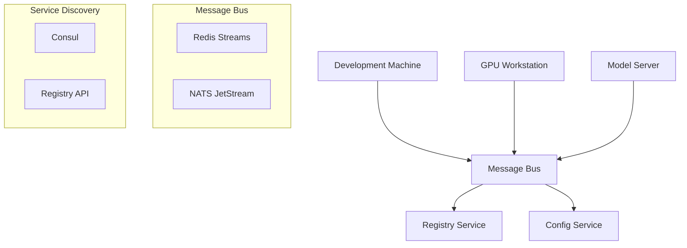

<!-- === OmniNode:Metadata ===
metadata_version: 0.1.0
protocol_version: 1.1.0
owner: OmniNode Team
copyright: OmniNode Team
schema_version: 1.1.0
name: infrastructure.md
version: 1.0.0
uuid: fe00195b-b51e-402c-a7b3-e915ce919caa
author: OmniNode Team
created_at: 2025-05-27T05:55:46.112910
last_modified_at: 2025-05-27T17:26:51.807519
description: Stamped by ONEX
state_contract: state_contract://default
lifecycle: active
hash: 5c20ef25ed4761245034c34c2731909ade2224ffaa3d5c543538edfd9a356c89
entrypoint: python@infrastructure.md
runtime_language_hint: python>=3.11
namespace: onex.stamped.infrastructure
meta_type: tool
<!-- === /OmniNode:Metadata === -->


# ONEX Infrastructure Specification

> **Status:** Canonical Reference  
> **Last Updated:** 2025-05-27  
> **Purpose:** Define the canonical infrastructure, hardware, model hosting, container standards, development tooling, security, and deployment requirements for the ONEX platform  
> **Audience:** Infrastructure engineers, DevOps teams, node authors, system administrators

---

## Overview

This document defines the infrastructure setup, hardware environment, model hosting configuration, and deployment considerations for local and distributed ONEX development and deployment.

---

## Hardware Requirements

### Minimum Requirements

| Component | Specification | Purpose |
|-----------|---------------|---------|
| **CPU** | 8 cores, 3.0+ GHz | Node execution, compilation |
| **RAM** | 16 GB | Runtime execution, caching |
| **Storage** | 100 GB SSD | Code, models, artifacts |
| **Network** | 1 Gbps | Registry sync, model downloads |

### Recommended Configuration

| Component | Specification | Purpose |
|-----------|---------------|---------|
| **CPU** | 16+ cores, 3.5+ GHz | Parallel node execution |
| **RAM** | 32+ GB | Large model hosting, caching |
| **Storage** | 500+ GB NVMe SSD | Fast I/O, model storage |
| **GPU** | 8+ GB VRAM (optional) | GPU-accelerated models |
| **Network** | 10 Gbps | High-throughput operations |

### High-Performance Setup

For organizations running large-scale ONEX deployments:

| Component | Specification | Purpose |
|-----------|---------------|---------|
| **CPU** | 32+ cores, 4.0+ GHz | Massive parallel execution |
| **RAM** | 64+ GB | Multiple concurrent models |
| **Storage** | 1+ TB NVMe SSD | Extensive model library |
| **GPU** | 24+ GB VRAM | Large language models |
| **Network** | 25+ Gbps | Enterprise-scale operations |

---

## Model Hosting

### Container-Based Model Runner (CMR)

The standard approach for model hosting across all platforms:

```yaml
# docker-compose.yml example
version: '3.8'
services:
  model-runner:
    image: onex/model-runner:latest
    ports:
      - "8000:8000"
    environment:
      - MODEL_NAME=deepseek-coder-33b
      - MODEL_QUANTIZATION=4bit
      - MAX_TOKENS=4096
    volumes:
      - ./models:/app/models
      - ./config:/app/config
    deploy:
      resources:
        reservations:
          devices:
            - driver: nvidia
              count: 1
              capabilities: [gpu]
```

### Benefits of Container-Based Hosting

- **Unified interface**: Consistent API across different models
- **Reproducibility**: Identical environments across deployments
- **Scalability**: Easy horizontal scaling with orchestrators
- **Isolation**: Model processes isolated from host system
- **Compatibility**: Works with vLLM, FastAPI, and custom adapters

### High-Performance Direct Hosting

For GPU-optimized deployments:

```bash
# Direct vLLM deployment
python -m vllm.entrypoints.api_server \
  --model deepseek-ai/deepseek-coder-33b-instruct \
  --quantization awq \
  --tensor-parallel-size 2 \
  --gpu-memory-utilization 0.9 \
  --host 0.0.0.0 \
  --port 8000
```

---

## Multi-Machine Development

### Network Architecture



### Node Connectivity

All machines connect via internal network using:

- **Redis Streams**: Intra-machine messaging and task queues
- **NATS JetStream**: Cross-node communication and event streaming
- **Consul**: Service discovery and configuration distribution
- **Registry API**: Node discovery and version resolution

### Filesystem Synchronization

```bash
# Git-based synchronization
git clone https://github.com/example/onex-nodes.git
cd onex-nodes

# Generate discovery manifest
onex run node_tree_generator --args='["--root-directory", ".", "--output-path", ".onextree"]'

# Sync with remote registry
onex registry sync --remote https://registry.example.com
```

### Command Routing

ONEX proxy routes tasks based on:

- **Model availability**: Route to machines with required models
- **Node capabilities**: Match execution requirements
- **Resource constraints**: Consider CPU, memory, GPU availability
- **Load balancing**: Distribute across available nodes

---

## Container Standards

### Directory Structure

Every containerized service must follow this structure:

```
containers/<service-name>/
├── Dockerfile
├── pyproject.toml
├── docker-compose.yml
├── config/
│   ├── default/
│   │   ├── app.yaml
│   │   └── logging.yaml
│   └── environments/
│       ├── development.yaml
│       ├── staging.yaml
│       └── production.yaml
├── src/<package>/
│   ├── api/
│   │   ├── __init__.py
│   │   ├── routes.py
│   │   └── middleware.py
│   ├── core/
│   │   ├── __init__.py
│   │   ├── models.py
│   │   └── services.py
│   └── utils/
│       ├── __init__.py
│       └── helpers.py
├── tests/
│   ├── unit/
│   ├── integration/
│   └── e2e/
├── docs/
│   ├── README.md
│   └── api.md
└── scripts/
    ├── entrypoint.sh
    └── healthcheck.sh
```

### Required Endpoints

All containerized services must implement:

```python
# Health check endpoint
@app.get("/health")
async def health_check():
    return {"status": "healthy", "timestamp": datetime.utcnow()}

# Metrics endpoint
@app.get("/metrics")
async def metrics():
    return {
        "requests_total": request_counter,
        "response_time_avg": avg_response_time,
        "memory_usage": get_memory_usage()
    }

# Ready endpoint
@app.get("/ready")
async def ready_check():
    # Check dependencies, database connections, etc.
    return {"status": "ready", "dependencies": check_dependencies()}
```

### Dockerfile Standards

```dockerfile
# Multi-stage build example
FROM python:3.11-slim as builder

WORKDIR /app
COPY pyproject.toml poetry.lock ./
RUN pip install poetry && \
    poetry config virtualenvs.create false && \
    poetry install --no-dev

FROM python:3.11-slim as runtime

# Create non-root user
RUN groupadd -r onex && useradd -r -g onex onex

WORKDIR /app
COPY --from=builder /usr/local/lib/python3.11/site-packages /usr/local/lib/python3.11/site-packages
COPY --from=builder /usr/local/bin /usr/local/bin
COPY src/ ./src/
COPY config/ ./config/
COPY scripts/ ./scripts/

# Set permissions
RUN chown -R onex:onex /app
USER onex

# Health check
HEALTHCHECK --interval=30s --timeout=10s --start-period=5s --retries=3 \
    CMD python scripts/healthcheck.py

EXPOSE 8000
ENTRYPOINT ["scripts/entrypoint.sh"]
CMD ["python", "-m", "src.app"]
```

---

## Development Tooling

### Code Quality Tools

```bash
# Format Python code
onex format --target src/

# Lint code
onex lint --target src/ --strict

# Type checking
onex typecheck --target src/

# Security scanning
onex security scan --target src/
```

### Pre-commit Hooks

```yaml
# .pre-commit-config.yaml
repos:
  - repo: local
    hooks:
      - id: onex-stamper
        name: ONEX Metadata Stamper
        entry: onex run stamper_node
        language: system
        files: \.(py|yaml|md)$
        
      - id: onex-tree-generator
        name: ONEX Tree Generator
        entry: onex run node_tree_generator
        language: system
        files: \.py$
        
      - id: onex-validator
        name: ONEX Validator
        entry: onex run parity_validator_node
        language: system
        files: \.(py|yaml)$
```

### Live Test Execution

```bash
# Run tests with live reloading
onex test watch --target tests/

# Run specific test categories
onex test --markers unit,integration

# Generate coverage report
onex test --coverage --output coverage.html
```

---

## Security Configuration

### Secret Management

```yaml
# config/security.yaml
secrets:
  sources:
    - type: environment
      prefix: ONEX_SECRET_
    - type: file
      path: /run/secrets
    - type: vault
      url: https://vault.example.com
      auth_method: kubernetes
  
  encryption:
    algorithm: AES-256-GCM
    key_rotation: 30d
    
  audit:
    enabled: true
    log_access: true
    log_failures: true
```

### Network Security

```yaml
# config/network.yaml
security:
  tls:
    enabled: true
    cert_path: /etc/ssl/certs/onex.crt
    key_path: /etc/ssl/private/onex.key
    min_version: "1.2"
    
  authentication:
    method: jwt
    issuer: https://auth.example.com
    audience: onex-api
    
  authorization:
    rbac_enabled: true
    default_role: readonly
    
  firewall:
    allow_internal: true
    block_external: true
    allowed_ports: [8000, 8080, 9090]
```

### Container Security

```bash
# Run containers with security constraints
docker run \
  --read-only \
  --no-new-privileges \
  --user 1000:1000 \
  --cap-drop ALL \
  --security-opt no-new-privileges:true \
  onex/model-runner:latest
```

---

## Deployment Patterns

### Local Development

```bash
# Start local development environment
docker-compose -f docker-compose.dev.yml up -d

# Run ONEX nodes locally
onex run my_node --env development

# Monitor logs
onex logs follow --service all
```

### Staging Deployment

```yaml
# docker-compose.staging.yml
version: '3.8'
services:
  onex-api:
    image: onex/api:${VERSION}
    environment:
      - ENV=staging
      - LOG_LEVEL=info
    deploy:
      replicas: 2
      resources:
        limits:
          memory: 1G
          cpus: '0.5'
        reservations:
          memory: 512M
          cpus: '0.25'
```

### Production Deployment

```yaml
# kubernetes/deployment.yaml
apiVersion: apps/v1
kind: Deployment
metadata:
  name: onex-api
spec:
  replicas: 3
  selector:
    matchLabels:
      app: onex-api
  template:
    metadata:
      labels:
        app: onex-api
    spec:
      containers:
      - name: api
        image: onex/api:v1.0.0
        ports:
        - containerPort: 8000
        env:
        - name: ENV
          value: "production"
        resources:
          requests:
            memory: "512Mi"
            cpu: "250m"
          limits:
            memory: "1Gi"
            cpu: "500m"
        livenessProbe:
          httpGet:
            path: /health
            port: 8000
          initialDelaySeconds: 30
          periodSeconds: 10
        readinessProbe:
          httpGet:
            path: /ready
            port: 8000
          initialDelaySeconds: 5
          periodSeconds: 5
```

---

## Monitoring and Observability

### Metrics Collection

```yaml
# config/monitoring.yaml
metrics:
  enabled: true
  endpoint: /metrics
  format: prometheus
  
  collectors:
    - system_metrics
    - application_metrics
    - custom_metrics
    
  labels:
    service: onex
    environment: ${ENV}
    version: ${VERSION}
```

### Logging Configuration

```yaml
# config/logging.yaml
logging:
  level: info
  format: json
  
  handlers:
    console:
      enabled: true
      level: info
    file:
      enabled: true
      path: /var/log/onex/app.log
      rotation: daily
      retention: 30d
    syslog:
      enabled: false
      facility: local0
      
  loggers:
    onex.core: info
    onex.api: debug
    onex.security: warning
```

### Distributed Tracing

```python
# Example tracing configuration
from opentelemetry import trace
from opentelemetry.exporter.jaeger.thrift import JaegerExporter
from opentelemetry.sdk.trace import TracerProvider
from opentelemetry.sdk.trace.export import BatchSpanProcessor

# Configure tracing
trace.set_tracer_provider(TracerProvider())
tracer = trace.get_tracer(__name__)

jaeger_exporter = JaegerExporter(
    agent_host_name="jaeger",
    agent_port=6831,
)

span_processor = BatchSpanProcessor(jaeger_exporter)
trace.get_tracer_provider().add_span_processor(span_processor)
```

---

## Performance Optimization

### Resource Management

```yaml
# config/resources.yaml
resources:
  cpu:
    cores: 8
    affinity: numa
    
  memory:
    limit: 16G
    swap: disabled
    huge_pages: enabled
    
  storage:
    cache_size: 4G
    io_scheduler: mq-deadline
    
  network:
    buffer_size: 64M
    tcp_window: 1M
```

### Caching Strategy

```python
# Example caching configuration
CACHE_CONFIG = {
    "redis": {
        "host": "redis.example.com",
        "port": 6379,
        "db": 0,
        "ttl": 3600,
    },
    "memory": {
        "max_size": "1G",
        "eviction_policy": "lru",
    },
    "disk": {
        "path": "/var/cache/onex",
        "max_size": "10G",
    }
}
```

### Load Balancing

```nginx
# nginx.conf example
upstream onex_backend {
    least_conn;
    server onex-api-1:8000 weight=3;
    server onex-api-2:8000 weight=3;
    server onex-api-3:8000 weight=2;
}

server {
    listen 80;
    server_name api.example.com;
    
    location / {
        proxy_pass http://onex_backend;
        proxy_set_header Host $host;
        proxy_set_header X-Real-IP $remote_addr;
        proxy_set_header X-Forwarded-For $proxy_add_x_forwarded_for;
        proxy_set_header X-Forwarded-Proto $scheme;
        
        # Health check
        proxy_next_upstream error timeout http_500 http_502 http_503;
        proxy_connect_timeout 5s;
        proxy_send_timeout 10s;
        proxy_read_timeout 10s;
    }
}
```

---

## Disaster Recovery

### Backup Strategy

```bash
# Automated backup script
#!/bin/bash

# Backup registry data
onex registry export --format json > backup/registry-$(date +%Y%m%d).json

# Backup configuration
tar -czf backup/config-$(date +%Y%m%d).tar.gz config/

# Backup models
rsync -av --progress models/ backup/models/

# Upload to remote storage
aws s3 sync backup/ s3://onex-backups/$(date +%Y%m%d)/
```

### Recovery Procedures

```bash
# Restore from backup
#!/bin/bash

BACKUP_DATE=$1

# Download backup
aws s3 sync s3://onex-backups/$BACKUP_DATE/ backup/

# Restore registry
onex registry import backup/registry-$BACKUP_DATE.json

# Restore configuration
tar -xzf backup/config-$BACKUP_DATE.tar.gz

# Restore models
rsync -av backup/models/ models/

# Restart services
docker-compose restart
```

---

## Best Practices

### Infrastructure Management

1. **Use Infrastructure as Code**: Define infrastructure using Terraform, Ansible, or similar tools
2. **Implement GitOps**: Manage deployments through Git workflows
3. **Monitor Everything**: Comprehensive monitoring of all components
4. **Automate Deployments**: Use CI/CD pipelines for consistent deployments
5. **Plan for Scale**: Design for horizontal scaling from the start

### Security Best Practices

1. **Principle of Least Privilege**: Grant minimal necessary permissions
2. **Defense in Depth**: Multiple layers of security controls
3. **Regular Updates**: Keep all components updated with security patches
4. **Audit Everything**: Comprehensive logging and audit trails
5. **Incident Response**: Have procedures for security incidents

### Performance Best Practices

1. **Profile Regularly**: Identify and address performance bottlenecks
2. **Cache Strategically**: Implement caching at multiple levels
3. **Optimize Resources**: Right-size compute and storage resources
4. **Monitor Trends**: Track performance metrics over time
5. **Plan Capacity**: Anticipate growth and scale proactively

---

## References

- [Configuration Management](./configuration.md)
- [Security Overview](./reference-security-overview.md)
- [Monitoring Specification](./monitoring.md)
- [Registry Architecture](./registry.md)

---

**Note:** This document serves as the canonical source of truth for ONEX infrastructure requirements and should be updated as the platform evolves.
