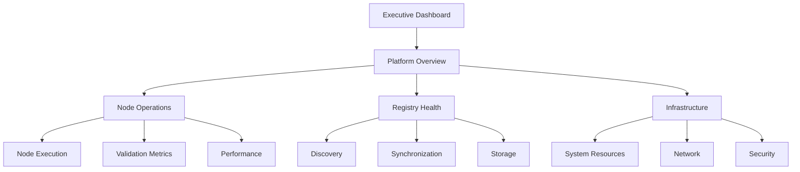

<!-- === OmniNode:Metadata ===
metadata_version: 0.1.0
protocol_version: 1.1.0
owner: OmniNode Team
copyright: OmniNode Team
schema_version: 1.1.0
name: metrics_dashboard.md
version: 1.0.0
uuid: a68d7dd3-5af4-4145-8556-7cec276b9c56
author: OmniNode Team
created_at: 2025-05-27T06:09:13.122814
last_modified_at: 2025-05-27T17:26:51.850315
description: Stamped by ONEX
state_contract: state_contract://default
lifecycle: active
hash: ecbe4e149786d8c38c7aa8ac799d35ef0230b6813ff886b6eabc2d1f52bcdf3c
entrypoint: python@metrics_dashboard.md
runtime_language_hint: python>=3.11
namespace: onex.stamped.metrics_dashboard
meta_type: tool
<!-- === /OmniNode:Metadata === -->


# ONEX Metrics Dashboard Specification

> **Status:** Canonical  
> **Last Updated:** 2025-01-27  
> **Purpose:** Define metrics dashboards, visualizations, and key performance indicators for comprehensive ONEX platform monitoring  
> **Audience:** DevOps engineers, SRE teams, system administrators, platform operators  
> **Companion:** [Monitoring Specification](./monitoring.md)

---

## Overview

This document defines the metrics dashboards, visualizations, and key performance indicators (KPIs) for monitoring the ONEX platform. These dashboards provide comprehensive visibility into system health, performance, and operational metrics across all platform components.

---

## Dashboard Architecture

### Dashboard Hierarchy



### Dashboard Categories

| Category | Purpose | Audience | Update Frequency |
|----------|---------|----------|------------------|
| **Executive** | High-level KPIs and business metrics | Leadership, stakeholders | Daily |
| **Platform** | Overall system health and performance | Operations, SRE | Real-time |
| **Component** | Detailed component-specific metrics | Engineers, developers | Real-time |
| **Security** | Security events and compliance | Security team | Real-time |
| **Troubleshooting** | Diagnostic and debugging information | Support, engineers | Real-time |

---

## Executive Dashboard

### Key Performance Indicators

#### System Availability
```yaml
availability_metrics:
  overall_uptime:
    target: 99.9%
    measurement: "Last 30 days"
    alert_threshold: 99.5%
  
  component_availability:
    registry: 99.95%
    execution_engine: 99.9%
    cli_interface: 99.8%
  
  mttr:
    target: "< 15 minutes"
    current: "12 minutes"
  
  mtbf:
    target: "> 720 hours"
    current: "840 hours"
```

#### Performance Metrics
```yaml
performance_kpis:
  node_execution_success_rate:
    target: 99.5%
    current: 99.7%
    trend: "stable"
  
  average_execution_time:
    target: "< 30 seconds"
    current: "18 seconds"
    trend: "improving"
  
  throughput:
    target: "1000 executions/hour"
    current: "1250 executions/hour"
    trend: "increasing"
  
  error_rate:
    target: "< 0.5%"
    current: "0.3%"
    trend: "stable"
```

#### Business Metrics
```yaml
business_kpis:
  active_users:
    daily: 150
    weekly: 300
    monthly: 450
  
  node_adoption:
    total_nodes: 85
    active_nodes: 72
    new_this_month: 8
  
  ecosystem_health:
    compliance_rate: 98.5%
    test_coverage: 87%
    documentation_coverage: 92%
```

### Executive Dashboard Layout

```json
{
  "dashboard": {
    "title": "ONEX Executive Dashboard",
    "refresh": "5m",
    "panels": [
      {
        "title": "System Health Score",
        "type": "stat",
        "targets": [
          {
            "expr": "onex_system_health_score",
            "legendFormat": "Health Score"
          }
        ],
        "thresholds": [
          {"color": "red", "value": 0},
          {"color": "yellow", "value": 80},
          {"color": "green", "value": 95}
        ]
      },
      {
        "title": "Platform Availability (30d)",
        "type": "stat",
        "targets": [
          {
            "expr": "avg_over_time(up{job=~'onex-.*'}[30d]) * 100",
            "legendFormat": "Availability %"
          }
        ]
      },
      {
        "title": "Node Execution Success Rate",
        "type": "graph",
        "targets": [
          {
            "expr": "rate(onex_node_executions_total{status='success'}[5m]) / rate(onex_node_executions_total[5m]) * 100",
            "legendFormat": "Success Rate %"
          }
        ]
      },
      {
        "title": "Active Users Trend",
        "type": "graph",
        "targets": [
          {
            "expr": "onex_active_users_daily",
            "legendFormat": "Daily Active Users"
          },
          {
            "expr": "onex_active_users_weekly",
            "legendFormat": "Weekly Active Users"
          }
        ]
      }
    ]
  }
}
```

---

## Platform Overview Dashboard

### System Health Monitoring

#### Overall Health Score
```yaml
health_score_calculation:
  components:
    - name: "registry"
      weight: 30
      metrics:
        - "registry_availability"
        - "registry_response_time"
        - "registry_error_rate"
    
    - name: "execution_engine"
      weight: 40
      metrics:
        - "execution_success_rate"
        - "execution_latency"
        - "resource_utilization"
    
    - name: "cli_interface"
      weight: 20
      metrics:
        - "cli_availability"
        - "command_success_rate"
        - "user_satisfaction"
    
    - name: "infrastructure"
      weight: 10
      metrics:
        - "cpu_utilization"
        - "memory_usage"
        - "disk_space"
        - "network_latency"
```

#### Service Status Grid
```yaml
service_status:
  layout: "grid"
  services:
    - name: "Registry Service"
      status: "healthy"
      uptime: "99.98%"
      last_incident: "2025-01-20"
    
    - name: "Execution Engine"
      status: "healthy"
      uptime: "99.95%"
      last_incident: "2025-01-15"
    
    - name: "CLI Interface"
      status: "warning"
      uptime: "99.85%"
      last_incident: "2025-01-25"
    
    - name: "Monitoring"
      status: "healthy"
      uptime: "99.99%"
      last_incident: "2025-01-10"
```

### Traffic and Usage Patterns

#### Request Volume
```yaml
traffic_metrics:
  total_requests:
    query: "sum(rate(onex_http_requests_total[5m]))"
    unit: "req/s"
    
  requests_by_endpoint:
    query: "sum(rate(onex_http_requests_total[5m])) by (endpoint)"
    unit: "req/s"
    
  requests_by_status:
    query: "sum(rate(onex_http_requests_total[5m])) by (status)"
    unit: "req/s"
```

#### Geographic Distribution
```yaml
geographic_metrics:
  requests_by_region:
    query: "sum(rate(onex_http_requests_total[5m])) by (region)"
    visualization: "world_map"
    
  latency_by_region:
    query: "histogram_quantile(0.95, rate(onex_http_request_duration_seconds_bucket[5m])) by (region)"
    visualization: "heatmap"
```

---

## Node Operations Dashboard

### Execution Metrics

#### Node Execution Overview
```yaml
execution_overview:
  total_executions:
    query: "sum(increase(onex_node_executions_total[1h]))"
    timeframe: "1h"
    
  success_rate:
    query: "sum(rate(onex_node_executions_total{status='success'}[5m])) / sum(rate(onex_node_executions_total[5m])) * 100"
    target: 99.5
    
  average_duration:
    query: "histogram_quantile(0.5, rate(onex_node_execution_duration_seconds_bucket[5m]))"
    unit: "seconds"
    
  concurrent_executions:
    query: "onex_active_executions"
    unit: "count"
```

#### Node Performance Breakdown
```yaml
performance_breakdown:
  execution_time_percentiles:
    p50: "histogram_quantile(0.50, rate(onex_node_execution_duration_seconds_bucket[5m]))"
    p90: "histogram_quantile(0.90, rate(onex_node_execution_duration_seconds_bucket[5m]))"
    p95: "histogram_quantile(0.95, rate(onex_node_execution_duration_seconds_bucket[5m]))"
    p99: "histogram_quantile(0.99, rate(onex_node_execution_duration_seconds_bucket[5m]))"
  
  top_slowest_nodes:
    query: "topk(10, avg(rate(onex_node_execution_duration_seconds_sum[5m])) by (node_name))"
    visualization: "table"
  
  most_executed_nodes:
    query: "topk(10, sum(rate(onex_node_executions_total[5m])) by (node_name))"
    visualization: "pie_chart"
```

### Validation Metrics

#### Parity Validator Performance
```yaml
validation_metrics:
  validation_runs:
    total: "sum(increase(onex_validation_runs_total[1h]))"
    success_rate: "sum(rate(onex_validation_runs_total{status='success'}[5m])) / sum(rate(onex_validation_runs_total[5m])) * 100"
    
  validation_duration:
    average: "avg(rate(onex_validation_duration_seconds_sum[5m]))"
    p95: "histogram_quantile(0.95, rate(onex_validation_duration_seconds_bucket[5m]))"
    
  error_breakdown:
    by_category: "sum(rate(onex_validation_errors_total[5m])) by (error_category)"
    by_severity: "sum(rate(onex_validation_errors_total[5m])) by (severity)"
```

#### Compliance Tracking
```yaml
compliance_metrics:
  overall_compliance:
    query: "onex_ecosystem_compliance_rate"
    target: 95
    unit: "percentage"
    
  compliance_by_category:
    schema: "onex_compliance_rate{category='schema'}"
    metadata: "onex_compliance_rate{category='metadata'}"
    lifecycle: "onex_compliance_rate{category='lifecycle'}"
    testing: "onex_compliance_rate{category='testing'}"
    
  non_compliant_nodes:
    query: "onex_non_compliant_nodes"
    visualization: "table"
    columns: ["node_name", "violation_type", "severity", "last_check"]
```

---

## Registry Health Dashboard

### Discovery and Synchronization

#### Registry Operations
```yaml
registry_operations:
  discovery_requests:
    query: "sum(rate(onex_registry_discovery_requests_total[5m]))"
    unit: "req/s"
    
  discovery_latency:
    query: "histogram_quantile(0.95, rate(onex_registry_discovery_duration_seconds_bucket[5m]))"
    unit: "seconds"
    target: 0.1
    
  cache_hit_rate:
    query: "sum(rate(onex_registry_cache_hits_total[5m])) / sum(rate(onex_registry_cache_requests_total[5m])) * 100"
    unit: "percentage"
    target: 90
```

#### Synchronization Health
```yaml
sync_metrics:
  sync_frequency:
    query: "increase(onex_registry_sync_operations_total[1h])"
    unit: "syncs/hour"
    
  sync_duration:
    query: "avg(rate(onex_registry_sync_duration_seconds_sum[5m]))"
    unit: "seconds"
    
  sync_errors:
    query: "sum(rate(onex_registry_sync_errors_total[5m]))"
    unit: "errors/s"
    
  data_freshness:
    query: "time() - onex_registry_last_sync_timestamp"
    unit: "seconds"
    alert_threshold: 300
```

### Storage and Capacity

#### Storage Metrics
```yaml
storage_metrics:
  total_nodes:
    query: "onex_registry_total_nodes"
    unit: "count"
    
  storage_usage:
    query: "onex_registry_storage_bytes"
    unit: "bytes"
    
  growth_rate:
    query: "rate(onex_registry_storage_bytes[24h])"
    unit: "bytes/day"
    
  capacity_utilization:
    query: "onex_registry_storage_bytes / onex_registry_storage_capacity * 100"
    unit: "percentage"
    alert_threshold: 80
```

---

## Infrastructure Dashboard

### System Resources

#### CPU and Memory
```yaml
system_resources:
  cpu_utilization:
    overall: "100 - (avg(irate(node_cpu_seconds_total{mode='idle'}[5m])) * 100)"
    by_service: "100 - (avg(irate(node_cpu_seconds_total{mode='idle'}[5m])) by (service) * 100)"
    
  memory_utilization:
    overall: "(1 - (node_memory_MemAvailable_bytes / node_memory_MemTotal_bytes)) * 100"
    by_service: "container_memory_usage_bytes / container_spec_memory_limit_bytes * 100"
    
  load_average:
    1m: "node_load1"
    5m: "node_load5"
    15m: "node_load15"
```

#### Storage and Network
```yaml
storage_network:
  disk_usage:
    query: "(node_filesystem_size_bytes - node_filesystem_avail_bytes) / node_filesystem_size_bytes * 100"
    unit: "percentage"
    
  disk_iops:
    read: "rate(node_disk_reads_completed_total[5m])"
    write: "rate(node_disk_writes_completed_total[5m])"
    
  network_throughput:
    ingress: "rate(node_network_receive_bytes_total[5m])"
    egress: "rate(node_network_transmit_bytes_total[5m])"
    
  network_errors:
    query: "rate(node_network_receive_errs_total[5m]) + rate(node_network_transmit_errs_total[5m])"
    unit: "errors/s"
```

### Application Performance

#### Response Times
```yaml
response_times:
  api_latency:
    p50: "histogram_quantile(0.50, rate(onex_http_request_duration_seconds_bucket[5m]))"
    p95: "histogram_quantile(0.95, rate(onex_http_request_duration_seconds_bucket[5m]))"
    p99: "histogram_quantile(0.99, rate(onex_http_request_duration_seconds_bucket[5m]))"
    
  database_latency:
    query: "histogram_quantile(0.95, rate(onex_database_query_duration_seconds_bucket[5m]))"
    unit: "seconds"
    
  cache_latency:
    query: "histogram_quantile(0.95, rate(onex_cache_operation_duration_seconds_bucket[5m]))"
    unit: "seconds"
```

---

## Security Dashboard

### Authentication and Authorization

#### Authentication Metrics
```yaml
auth_metrics:
  login_attempts:
    total: "sum(rate(onex_authentication_attempts_total[5m]))"
    successful: "sum(rate(onex_authentication_attempts_total{result='success'}[5m]))"
    failed: "sum(rate(onex_authentication_attempts_total{result='failure'}[5m]))"
    
  active_sessions:
    query: "onex_active_sessions"
    unit: "count"
    
  session_duration:
    average: "avg(onex_session_duration_seconds)"
    p95: "histogram_quantile(0.95, onex_session_duration_seconds_bucket)"
```

#### Security Events
```yaml
security_events:
  failed_logins:
    query: "sum(rate(onex_authentication_attempts_total{result='failure'}[5m]))"
    alert_threshold: 10
    
  permission_denials:
    query: "sum(rate(onex_authorization_checks_total{result='denied'}[5m]))"
    unit: "denials/s"
    
  suspicious_activity:
    query: "sum(rate(onex_security_events_total{severity='high'}[5m]))"
    unit: "events/s"
    
  vulnerability_scans:
    last_scan: "onex_last_vulnerability_scan_timestamp"
    vulnerabilities_found: "onex_vulnerabilities_total"
```

---

## Alerting Integration

### Alert Thresholds

#### Critical Alerts
```yaml
critical_alerts:
  system_down:
    condition: "up{job='onex-api'} == 0"
    duration: "1m"
    
  high_error_rate:
    condition: "rate(onex_http_requests_total{status=~'5..'}[5m]) / rate(onex_http_requests_total[5m]) > 0.05"
    duration: "2m"
    
  execution_failure_spike:
    condition: "rate(onex_node_executions_total{status='error'}[5m]) > 0.1"
    duration: "5m"
```

#### Warning Alerts
```yaml
warning_alerts:
  high_latency:
    condition: "histogram_quantile(0.95, rate(onex_http_request_duration_seconds_bucket[5m])) > 1"
    duration: "5m"
    
  low_cache_hit_rate:
    condition: "rate(onex_cache_hits_total[5m]) / rate(onex_cache_requests_total[5m]) < 0.8"
    duration: "10m"
    
  storage_usage_high:
    condition: "onex_registry_storage_bytes / onex_registry_storage_capacity > 0.8"
    duration: "15m"
```

### Alert Routing

```yaml
alert_routing:
  critical:
    channels: ["pagerduty", "slack-critical"]
    escalation: "immediate"
    
  warning:
    channels: ["slack-alerts", "email"]
    escalation: "15m"
    
  info:
    channels: ["slack-info"]
    escalation: "none"
```

---

## Dashboard Configuration

### Grafana Dashboard JSON

```json
{
  "dashboard": {
    "id": null,
    "title": "ONEX Platform Overview",
    "tags": ["onex", "platform", "overview"],
    "timezone": "UTC",
    "refresh": "30s",
    "time": {
      "from": "now-1h",
      "to": "now"
    },
    "panels": [
      {
        "id": 1,
        "title": "System Health Score",
        "type": "stat",
        "gridPos": {"h": 8, "w": 12, "x": 0, "y": 0},
        "targets": [
          {
            "expr": "onex_system_health_score",
            "legendFormat": "Health Score",
            "refId": "A"
          }
        ],
        "fieldConfig": {
          "defaults": {
            "thresholds": {
              "steps": [
                {"color": "red", "value": 0},
                {"color": "yellow", "value": 80},
                {"color": "green", "value": 95}
              ]
            },
            "unit": "percent"
          }
        }
      }
    ]
  }
}
```

### Dashboard Variables

```yaml
dashboard_variables:
  environment:
    type: "query"
    query: "label_values(onex_info, environment)"
    multi: false
    
  service:
    type: "query"
    query: "label_values(onex_info{environment='$environment'}, service)"
    multi: true
    
  time_range:
    type: "interval"
    options: ["5m", "15m", "1h", "6h", "24h"]
    default: "1h"
```

---

## Custom Metrics

### Business Metrics

```yaml
business_metrics:
  node_adoption_rate:
    calculation: "new_nodes_this_month / total_nodes * 100"
    unit: "percentage"
    
  user_engagement:
    calculation: "active_users_daily / total_registered_users * 100"
    unit: "percentage"
    
  ecosystem_growth:
    calculation: "rate(onex_total_nodes[30d])"
    unit: "nodes/day"
```

### Operational Metrics

```yaml
operational_metrics:
  deployment_frequency:
    calculation: "increase(onex_deployments_total[7d])"
    unit: "deployments/week"
    
  change_failure_rate:
    calculation: "sum(onex_failed_deployments_total) / sum(onex_deployments_total) * 100"
    unit: "percentage"
    
  lead_time:
    calculation: "avg(onex_deployment_lead_time_seconds)"
    unit: "seconds"
```

---

## Dashboard Maintenance

### Update Procedures

1. **Regular Review**: Monthly review of dashboard relevance and accuracy
2. **Metric Validation**: Quarterly validation of metric calculations
3. **Performance Optimization**: Optimize queries for better dashboard performance
4. **User Feedback**: Collect and incorporate user feedback on dashboard usability

### Version Control

```yaml
dashboard_versioning:
  storage: "git repository"
  backup_frequency: "daily"
  change_tracking: "enabled"
  rollback_capability: "enabled"
```

---

## References

- [Monitoring Specification](./monitoring.md)
- [Infrastructure Specification](./infrastructure.md)
- [Error Handling](./error_handling.md)
- [Security Overview](./reference-security-overview.md)

---

**Note:** This dashboard specification should be regularly updated to reflect changes in the platform architecture and monitoring requirements. All dashboards should be tested and validated before deployment to production environments.
