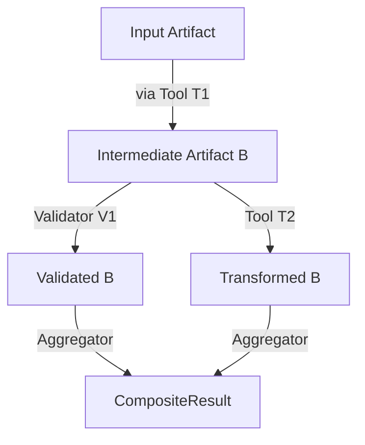

# Milestone 07 – Function Composition Framework

> **Target version:** v0.10.x (major features land before 2025‑11‑30)
> **Status:** Planned
> **Champion:** Runtime sub‑team
> **Milestone window:** 2025‑08‑01 → 2025‑09‑30
> **Depends on:** Milestones 02, 03, 04, 06

---

## 1 · Problem Statement

Current orchestration executes **one tool/validator at a time**. Real‐world agent workflows require **pipelines** of heterogeneous functions with branching, fan‑out/fan‑in, and conditional logic. We need a first‑class **composition framework** so that:

* Developers (and agents) describe pipelines declaratively.
* The runtime resolves dependencies, schedules steps, and exposes results.
* Registries store, version and query composite functions just like single functions.

---

## 2 · Scope (MVP)

* **DSL & Schema** – YAML/JSON spec for describing DAGs of registered functions.

  * Nodes: reference `uuid` or `name@version`.
  * Edges: explicit or inferred via input/output type matching.
* **Planner / Resolver** – turn a spec into an executable execution plan (topological sort, type‑compatible joins).
* **Scheduler** – serial & basic parallel execution using async orchestrator from Milestone 03.

  * Automatic back‑pressure using bounded semaphore.
* **Result Aggregation** – collect individual `Result` objects into a `CompositeResult` object with lineage map.
* **Registry Support** – `PipelineRegistry` with CRUD, metadata & lifecycle fields identical to other registries.
* **CLI** – `omnibase compose` and `omnibase run pipeline <pipeline-id>`.
* **Test Harness** – fixtures for unit + integration tests; golden sample pipelines.

### Out‑of‑scope (MVP)

* Cyclic graph detection beyond simple cycle check.
* Dynamic runtime graph mutation (will be Phase 2).
* Cost‑aware or ML‑based optimisation (stretch).

---

## 3 · Deliverables

| # | Deliverable                              | Owner         | Acceptance criteria                                                                           |
| - | ---------------------------------------- | ------------- | --------------------------------------------------------------------------------------------- |
| 1 | `pipeline.schema.json` & Pydantic models | **Schema WG** | Parses & validates example specs; doc generated in docs site                                  |
| 2 | `planner.py`                             | **Runtime**   | Resolves sample DAG in <20 ms, detects type mismatches                                        |
| 3 | `scheduler.py`                           | **Runtime**   | Executes demo pipeline with parallel fan‑out; provides deterministic ordering for serial mode |
| 4 | `pipeline_registry.py`                   | **Registry**  | CRUD, filter by tags/lifecycle, backed by Postgres                                            |
| 5 | Composite `Result` classes               | **Models**    | MyPy‑clean; includes provenance tree                                                          |
| 6 | CLI commands                             | **CLI/UX**    | Covered by e2e test, supports `--dry-run` plan output                                         |
| 7 | Docs & tutorial                          | **Docs**      | Walk‑through from spec → results                                                              |

---

## 4 · Design Outline



* **Spec example**
  A minimal two‑step pipeline:

  ```yaml
  pipeline_version: "0.1"
  name: sample_pipeline
  steps:
    - id: step_1
      ref: tool://format_headers@^1.2
    - id: step_2
      ref: validator://schema_check@latest
      needs: [step_1]
  ```
* Planner ensures `step_2` consumes output type of `step_1`.
* Scheduler executes `step_1` then `step_2`, merges results.

---

## 5 · Timeline & Checkpoints

* **2025‑08‑15** – Schema & models merged `main`.
* **2025‑08‑31** – Planner + basic scheduler feature‑complete.
* **2025‑09‑15** – Registry / CLI integration & docs draft.
* **2025‑09‑30** – Milestone retro; promote to `stable`.

---

## 6 · Risks & Mitigations

| Risk                                                 | Impact               | Mitigation                                                |
| ---------------------------------------------------- | -------------------- | --------------------------------------------------------- |
| DAG planner complexity explodes with type  inference | Delay                | Start with explicit `needs` list; type inference optional |
| Parallel execution bugs / race conditions            | Inconsistent results | Cover with property‑based tests & async stress harness    |
| Registry bloat with composite IDs                    | Storage              | Pipeline metadata GC policy + pagination                  |

---

## 7 · Stretch Goals

* **Graph optimisation** – topological grouping for minimal latency.
* **Cost model** – estimate runtime & choose fast path.
* **Visual editor** – web UI to drag/drop pipeline DAG.

---

▶︎ **Exit criteria:** Demo pipeline running in CI, returned `CompositeResult` passes schema validation, docs tutorial published.
