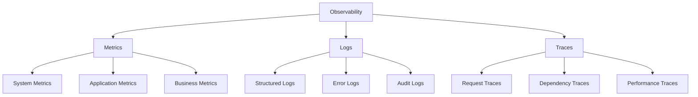

<!-- === OmniNode:Metadata ===
metadata_version: 0.1.0
protocol_version: 1.1.0
owner: OmniNode Team
copyright: OmniNode Team
schema_version: 1.1.0
name: monitoring.md
version: 1.0.0
uuid: fa0ca0c1-b8da-462e-a983-f6809f3df4d4
author: OmniNode Team
created_at: 2025-05-27T05:57:19.578552
last_modified_at: 2025-05-27T17:26:51.845301
description: Stamped by ONEX
state_contract: state_contract://default
lifecycle: active
hash: f07beef67274b2e0d2d73244169c1003b55a7655671af8609681b4ae499433bc
entrypoint: python@monitoring.md
runtime_language_hint: python>=3.11
namespace: onex.stamped.monitoring
meta_type: tool
<!-- === /OmniNode:Metadata === -->


# ONEX Monitoring and Observability Specification

> **Status:** Canonical  
> **Last Updated:** 2025-05-27  
> **Purpose:** Define canonical monitoring, alerting, analytics, and observability protocols for the ONEX platform  
> **Audience:** DevOps engineers, SRE teams, system administrators, node authors  
> **Enforcement:** All ONEX components must implement these monitoring standards

---

## Overview

This document defines the monitoring, alerting, analytics, and observability protocols for the ONEX platform. All agents, validators, nodes, and infrastructure components must implement these standards to ensure comprehensive system visibility and operational excellence.

---

## Core Monitoring Principles

### 1. Observability by Design
- **Metrics**: Quantitative measurements of system behavior
- **Logs**: Detailed records of system events and operations
- **Traces**: Request flow through distributed components
- **Events**: Discrete occurrences that affect system state

### 2. Three Pillars of Observability



### 3. Monitoring Hierarchy

| Level | Scope | Examples |
|-------|-------|----------|
| **Infrastructure** | Hardware, OS, Network | CPU, Memory, Disk, Network I/O |
| **Platform** | ONEX Runtime, Registry | Node execution, Registry operations |
| **Application** | Business Logic | Validation success rates, Processing times |
| **User Experience** | End-user Impact | Response times, Error rates |

---

## Metrics Framework

### System-Level Metrics

#### Infrastructure Metrics
```yaml
# Infrastructure monitoring configuration
infrastructure_metrics:
  cpu:
    - usage_percent
    - load_average_1m
    - load_average_5m
    - load_average_15m
  
  memory:
    - usage_percent
    - available_bytes
    - swap_usage_percent
    - cache_hit_ratio
  
  disk:
    - usage_percent
    - read_iops
    - write_iops
    - read_latency_ms
    - write_latency_ms
  
  network:
    - bytes_in_per_sec
    - bytes_out_per_sec
    - packets_in_per_sec
    - packets_out_per_sec
    - connection_count
```

#### Platform Metrics
```yaml
# ONEX platform monitoring
platform_metrics:
  registry:
    - node_count_total
    - node_discovery_time_ms
    - registry_sync_duration_ms
    - registry_errors_total
  
  execution:
    - node_executions_total
    - node_execution_duration_ms
    - node_execution_errors_total
    - concurrent_executions
  
  validation:
    - validation_runs_total
    - validation_success_rate
    - validation_duration_ms
    - validation_errors_by_type
```

### Application-Level Metrics

#### Node Execution Metrics
```python
# Example metrics collection in Python
from prometheus_client import Counter, Histogram, Gauge

# Execution counters
node_executions_total = Counter(
    'onex_node_executions_total',
    'Total number of node executions',
    ['node_name', 'version', 'status']
)

# Execution duration
node_execution_duration = Histogram(
    'onex_node_execution_duration_seconds',
    'Time spent executing nodes',
    ['node_name', 'version']
)

# Active executions
active_executions = Gauge(
    'onex_active_executions',
    'Number of currently executing nodes',
    ['node_name']
)

# Usage example
@monitor_execution
def execute_node(node_name: str, version: str):
    with node_execution_duration.labels(node_name, version).time():
        active_executions.labels(node_name).inc()
        try:
            result = perform_execution()
            node_executions_total.labels(node_name, version, 'success').inc()
            return result
        except Exception as e:
            node_executions_total.labels(node_name, version, 'error').inc()
            raise
        finally:
            active_executions.labels(node_name).dec()
```

#### Validation Metrics
```python
# Validation monitoring
validation_runs_total = Counter(
    'onex_validation_runs_total',
    'Total validation runs',
    ['validator_type', 'status']
)

validation_errors_by_category = Counter(
    'onex_validation_errors_total',
    'Validation errors by category',
    ['error_category', 'error_code']
)

validation_duration = Histogram(
    'onex_validation_duration_seconds',
    'Validation execution time',
    ['validator_type']
)
```

### Business Metrics
```yaml
# Business-level monitoring
business_metrics:
  productivity:
    - nodes_created_per_day
    - successful_deployments_per_week
    - time_to_production_hours
  
  quality:
    - test_coverage_percent
    - bug_detection_rate
    - security_scan_pass_rate
  
  adoption:
    - active_users_count
    - node_usage_frequency
    - feature_adoption_rate
```

---

## Alerting Framework

### Alert Severity Levels

| Severity | Description | Response Time | Escalation |
|----------|-------------|---------------|------------|
| **Critical** | System down, data loss | Immediate | Page on-call |
| **High** | Degraded performance | 15 minutes | Notify team |
| **Medium** | Potential issues | 1 hour | Create ticket |
| **Low** | Informational | 24 hours | Log only |

### Alert Rules Configuration

```yaml
# Prometheus alerting rules
groups:
  - name: onex.critical
    rules:
      - alert: ONEXNodeExecutionFailureRate
        expr: rate(onex_node_executions_total{status="error"}[5m]) > 0.1
        for: 2m
        labels:
          severity: critical
        annotations:
          summary: "High node execution failure rate"
          description: "Node execution failure rate is {{ $value }} per second"
          runbook_url: "https://docs.example.com/runbooks/node-failures"
      
      - alert: ONEXRegistryDown
        expr: up{job="onex-registry"} == 0
        for: 1m
        labels:
          severity: critical
        annotations:
          summary: "ONEX Registry is down"
          description: "Registry service is not responding"
          runbook_url: "https://docs.example.com/runbooks/registry-down"

  - name: onex.warning
    rules:
      - alert: ONEXHighValidationLatency
        expr: histogram_quantile(0.95, rate(onex_validation_duration_seconds_bucket[5m])) > 30
        for: 5m
        labels:
          severity: high
        annotations:
          summary: "High validation latency"
          description: "95th percentile validation latency is {{ $value }}s"
      
      - alert: ONEXLowTestCoverage
        expr: onex_test_coverage_percent < 80
        for: 10m
        labels:
          severity: medium
        annotations:
          summary: "Test coverage below threshold"
          description: "Test coverage is {{ $value }}%"
```

### Alert Routing

```yaml
# Alertmanager configuration
route:
  group_by: ['alertname', 'cluster', 'service']
  group_wait: 10s
  group_interval: 10s
  repeat_interval: 1h
  receiver: 'default'
  routes:
    - match:
        severity: critical
      receiver: 'pager'
      group_wait: 0s
      repeat_interval: 5m
    
    - match:
        severity: high
      receiver: 'team-chat'
      repeat_interval: 15m
    
    - match:
        severity: medium
      receiver: 'email'
      repeat_interval: 4h

receivers:
  - name: 'default'
    webhook_configs:
      - url: 'https://hooks.example.com/default'
  
  - name: 'pager'
    pagerduty_configs:
      - service_key: 'YOUR_PAGERDUTY_KEY'
        description: '{{ range .Alerts }}{{ .Annotations.summary }}{{ end }}'
  
  - name: 'team-chat'
    slack_configs:
      - api_url: 'YOUR_SLACK_WEBHOOK'
        channel: '#onex-alerts'
        title: 'ONEX Alert'
        text: '{{ range .Alerts }}{{ .Annotations.description }}{{ end }}'
  
  - name: 'email'
    email_configs:
      - to: 'team@example.com'
        subject: 'ONEX Alert: {{ .GroupLabels.alertname }}'
        body: '{{ range .Alerts }}{{ .Annotations.description }}{{ end }}'
```

---

## Logging Standards

### Structured Logging Format

All ONEX components must use structured JSON logging:

```json
{
  "timestamp": "2025-05-27T10:30:00.000Z",
  "level": "INFO",
  "service": "onex-registry",
  "version": "1.0.0",
  "correlation_id": "550e8400-e29b-41d4-a716-446655440000",
  "message": "Node execution completed",
  "context": {
    "node_name": "validator_node",
    "node_version": "1.2.0",
    "execution_time_ms": 1250,
    "status": "success"
  },
  "metadata": {
    "user_id": "user123",
    "session_id": "session456",
    "request_id": "req789"
  }
}
```

### Log Levels

| Level | Usage | Examples |
|-------|-------|----------|
| **TRACE** | Detailed debugging | Function entry/exit, variable values |
| **DEBUG** | Development debugging | Algorithm steps, state changes |
| **INFO** | General information | Successful operations, status updates |
| **WARN** | Potential issues | Deprecated usage, fallback actions |
| **ERROR** | Error conditions | Failed operations, exceptions |
| **FATAL** | Critical failures | System crashes, unrecoverable errors |

### Logging Configuration

```python
# Python logging configuration
import logging
import json
from datetime import datetime

class JSONFormatter(logging.Formatter):
    def format(self, record):
        log_entry = {
            "timestamp": datetime.utcnow().isoformat() + "Z",
            "level": record.levelname,
            "service": "onex-service",
            "message": record.getMessage(),
            "module": record.module,
            "function": record.funcName,
            "line": record.lineno
        }
        
        # Add correlation ID if available
        if hasattr(record, 'correlation_id'):
            log_entry["correlation_id"] = record.correlation_id
        
        # Add context if available
        if hasattr(record, 'context'):
            log_entry["context"] = record.context
        
        return json.dumps(log_entry)

# Configure logger
logger = logging.getLogger("onex")
handler = logging.StreamHandler()
handler.setFormatter(JSONFormatter())
logger.addHandler(handler)
logger.setLevel(logging.INFO)
```

### Log Aggregation

```yaml
# Fluentd configuration for log aggregation
<source>
  @type tail
  path /var/log/onex/*.log
  pos_file /var/log/fluentd/onex.log.pos
  tag onex.*
  format json
  time_key timestamp
  time_format %Y-%m-%dT%H:%M:%S.%LZ
</source>

<filter onex.**>
  @type record_transformer
  <record>
    hostname ${hostname}
    environment ${ENV}
  </record>
</filter>

<match onex.**>
  @type elasticsearch
  host elasticsearch.example.com
  port 9200
  index_name onex-logs
  type_name _doc
  include_tag_key true
  tag_key @log_name
  flush_interval 10s
</match>
```

---

## Distributed Tracing

### Trace Context Propagation

```python
# OpenTelemetry tracing setup
from opentelemetry import trace
from opentelemetry.exporter.jaeger.thrift import JaegerExporter
from opentelemetry.sdk.trace import TracerProvider
from opentelemetry.sdk.trace.export import BatchSpanProcessor
from opentelemetry.instrumentation.requests import RequestsInstrumentor

# Configure tracing
trace.set_tracer_provider(TracerProvider())
tracer = trace.get_tracer(__name__)

# Configure Jaeger exporter
jaeger_exporter = JaegerExporter(
    agent_host_name="jaeger.example.com",
    agent_port=6831,
)

span_processor = BatchSpanProcessor(jaeger_exporter)
trace.get_tracer_provider().add_span_processor(span_processor)

# Auto-instrument HTTP requests
RequestsInstrumentor().instrument()

# Manual instrumentation example
def execute_node_with_tracing(node_name: str, version: str):
    with tracer.start_as_current_span("node_execution") as span:
        span.set_attribute("node.name", node_name)
        span.set_attribute("node.version", version)
        
        try:
            result = execute_node(node_name, version)
            span.set_attribute("execution.status", "success")
            span.set_attribute("execution.result_size", len(str(result)))
            return result
        except Exception as e:
            span.set_attribute("execution.status", "error")
            span.set_attribute("execution.error", str(e))
            span.record_exception(e)
            raise
```

### Trace Sampling

```yaml
# Trace sampling configuration
tracing:
  sampling:
    # Sample 100% of error traces
    error_traces: 1.0
    
    # Sample 10% of successful traces
    success_traces: 0.1
    
    # Sample 50% of slow traces (>1s)
    slow_traces: 0.5
    slow_threshold_ms: 1000
  
  exporters:
    jaeger:
      endpoint: "http://jaeger.example.com:14268/api/traces"
      batch_size: 100
      timeout_ms: 5000
    
    zipkin:
      endpoint: "http://zipkin.example.com:9411/api/v2/spans"
      batch_size: 50
```

---

## Performance Monitoring

### Application Performance Monitoring (APM)

```python
# Performance monitoring decorators
import time
import functools
from typing import Callable, Any

def monitor_performance(operation_name: str):
    def decorator(func: Callable) -> Callable:
        @functools.wraps(func)
        def wrapper(*args, **kwargs) -> Any:
            start_time = time.time()
            
            try:
                result = func(*args, **kwargs)
                duration = time.time() - start_time
                
                # Record successful execution
                performance_metrics.record_execution(
                    operation=operation_name,
                    duration=duration,
                    status="success"
                )
                
                return result
            except Exception as e:
                duration = time.time() - start_time
                
                # Record failed execution
                performance_metrics.record_execution(
                    operation=operation_name,
                    duration=duration,
                    status="error",
                    error_type=type(e).__name__
                )
                
                raise
        return wrapper
    return decorator

# Usage
@monitor_performance("node_validation")
def validate_node(node_path: str) -> bool:
    # Validation logic
    pass
```

### Resource Utilization Monitoring

```python
# Resource monitoring
import psutil
import threading
import time

class ResourceMonitor:
    def __init__(self, interval: int = 60):
        self.interval = interval
        self.running = False
        self.thread = None
    
    def start(self):
        self.running = True
        self.thread = threading.Thread(target=self._monitor_loop)
        self.thread.start()
    
    def stop(self):
        self.running = False
        if self.thread:
            self.thread.join()
    
    def _monitor_loop(self):
        while self.running:
            # CPU metrics
            cpu_percent = psutil.cpu_percent(interval=1)
            cpu_count = psutil.cpu_count()
            load_avg = psutil.getloadavg()
            
            # Memory metrics
            memory = psutil.virtual_memory()
            swap = psutil.swap_memory()
            
            # Disk metrics
            disk = psutil.disk_usage('/')
            disk_io = psutil.disk_io_counters()
            
            # Network metrics
            network_io = psutil.net_io_counters()
            
            # Record metrics
            self._record_metrics({
                'cpu_percent': cpu_percent,
                'cpu_count': cpu_count,
                'load_avg_1m': load_avg[0],
                'load_avg_5m': load_avg[1],
                'load_avg_15m': load_avg[2],
                'memory_percent': memory.percent,
                'memory_available': memory.available,
                'swap_percent': swap.percent,
                'disk_percent': disk.percent,
                'disk_free': disk.free,
                'network_bytes_sent': network_io.bytes_sent,
                'network_bytes_recv': network_io.bytes_recv
            })
            
            time.sleep(self.interval)
    
    def _record_metrics(self, metrics: dict):
        # Send metrics to monitoring system
        for metric_name, value in metrics.items():
            monitoring_client.gauge(f"system.{metric_name}", value)
```

---

## Dashboard Configuration

### Grafana Dashboard Example

```json
{
  "dashboard": {
    "title": "ONEX System Overview",
    "panels": [
      {
        "title": "Node Execution Rate",
        "type": "graph",
        "targets": [
          {
            "expr": "rate(onex_node_executions_total[5m])",
            "legendFormat": "{{node_name}} - {{status}}"
          }
        ]
      },
      {
        "title": "Validation Success Rate",
        "type": "stat",
        "targets": [
          {
            "expr": "rate(onex_validation_runs_total{status=\"success\"}[5m]) / rate(onex_validation_runs_total[5m]) * 100",
            "legendFormat": "Success Rate %"
          }
        ]
      },
      {
        "title": "System Resource Usage",
        "type": "graph",
        "targets": [
          {
            "expr": "system.cpu_percent",
            "legendFormat": "CPU %"
          },
          {
            "expr": "system.memory_percent",
            "legendFormat": "Memory %"
          },
          {
            "expr": "system.disk_percent",
            "legendFormat": "Disk %"
          }
        ]
      }
    ]
  }
}
```

### Custom Metrics Dashboard

```yaml
# Dashboard configuration
dashboards:
  onex_overview:
    title: "ONEX Platform Overview"
    refresh: "30s"
    panels:
      - title: "Active Nodes"
        query: "count(up{job=~'onex-.*'})"
        type: "single_stat"
      
      - title: "Execution Throughput"
        query: "rate(onex_node_executions_total[5m])"
        type: "graph"
        legend: "{{node_name}}"
      
      - title: "Error Rate by Category"
        query: "rate(onex_validation_errors_total[5m])"
        type: "pie_chart"
        legend: "{{error_category}}"
      
      - title: "Response Time Distribution"
        query: "histogram_quantile(0.95, rate(onex_node_execution_duration_seconds_bucket[5m]))"
        type: "heatmap"
```

---

## Integration with ONEX CLI

### Monitoring Commands

```bash
# View system metrics
onex metrics system --format table

# Monitor node executions
onex metrics nodes --watch --interval 5s

# Check validation statistics
onex metrics validation --since "1h"

# Export metrics for analysis
onex metrics export --format json --output metrics.json

# View active alerts
onex alerts list --severity critical,high

# Acknowledge alerts
onex alerts ack --id alert-123

# Generate monitoring report
onex monitoring report --period "24h" --format pdf
```

### Health Check Commands

```bash
# Check overall system health
onex health check --all

# Check specific components
onex health check --components registry,execution,validation

# Run health check with detailed output
onex health check --verbose --format json

# Monitor health continuously
onex health monitor --interval 30s --alert-on-failure
```

---

## Best Practices

### For Developers

1. **Instrument Early**: Add monitoring from the beginning of development
2. **Use Structured Logging**: Always use structured, machine-readable logs
3. **Include Context**: Add correlation IDs and relevant context to logs
4. **Monitor Business Metrics**: Track metrics that matter to users
5. **Test Monitoring**: Include monitoring in your testing strategy

### For Operations

1. **Set Meaningful Alerts**: Alert on symptoms, not causes
2. **Reduce Alert Fatigue**: Tune alert thresholds to minimize false positives
3. **Document Runbooks**: Provide clear procedures for alert response
4. **Regular Review**: Periodically review and update monitoring configuration
5. **Capacity Planning**: Use monitoring data for capacity planning

### For Security

1. **Audit Monitoring Access**: Control who can view sensitive metrics
2. **Secure Monitoring Data**: Encrypt monitoring data in transit and at rest
3. **Monitor Security Events**: Track authentication, authorization, and access patterns
4. **Incident Response**: Use monitoring data for security incident investigation
5. **Compliance Reporting**: Generate compliance reports from monitoring data

---

## References

- [Error Handling Specification](./error_handling.md)
- [Infrastructure Specification](./infrastructure.md)
- [Security Overview](./reference-security-overview.md)
- [Configuration Management](./configuration.md)

---

**Enforcement:** All ONEX components must implement these monitoring standards. Compliance is verified through automated testing and code review.
