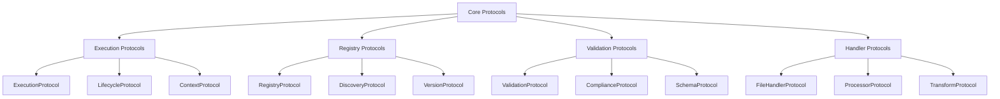

# ONEX Protocols and Models

> **Status:** Canonical  
> **Last Updated:** 2025-01-27  
> **Purpose:** Define all protocols, data models, and their relationships in the ONEX ecosystem  
> **Audience:** Developers, architects, system integrators  
> **Companion:** [Core Protocols](./protocols.md), [Execution Context](./execution_context.md)

---

## Overview

This document provides a comprehensive reference for all protocols and data models used throughout the ONEX platform. It defines the contracts, interfaces, and data structures that enable interoperability and extensibility across the ecosystem.

---

## Core Protocol Hierarchy

### Protocol Classification



### Protocol Design Principles

1. **Structural Typing**: Use Protocol classes for duck typing
2. **Minimal Interfaces**: Keep protocols focused and minimal
3. **Composability**: Protocols can be combined and extended
4. **Backward Compatibility**: Maintain compatibility across versions
5. **Clear Contracts**: Well-defined input/output specifications

---

## Execution Protocols

### ExecutionProtocol

```python
from typing import Protocol, Any, Dict, Optional
from dataclasses import dataclass
from enum import Enum

class ExecutionStatus(Enum):
    """Execution status enumeration."""
    PENDING = "pending"
    RUNNING = "running"
    SUCCESS = "success"
    FAILURE = "failure"
    TIMEOUT = "timeout"
    CANCELLED = "cancelled"

@dataclass
class ExecutionResult:
    """Result of an execution operation."""
    status: ExecutionStatus
    output: Optional[str] = None
    error: Optional[str] = None
    exit_code: Optional[int] = None
    duration_ms: Optional[int] = None
    metadata: Dict[str, Any] = None

class ExecutionProtocol(Protocol):
    """Protocol for executable components."""
    
    def execute(self, context: 'ExecutionContext') -> ExecutionResult:
        """Execute the component with given context.
        
        Args:
            context: Execution context with capabilities and environment
            
        Returns:
            Execution result with status and output
        """
        ...
    
    def validate_context(self, context: 'ExecutionContext') -> bool:
        """Validate that context meets execution requirements.
        
        Args:
            context: Execution context to validate
            
        Returns:
            True if context is valid for execution
        """
        ...
    
    def get_required_capabilities(self) -> List['Capability']:
        """Get list of required capabilities for execution.
        
        Returns:
            List of required capability objects
        """
        ...
```

### LifecycleProtocol

```python
from enum import Enum

class LifecycleState(Enum):
    """Component lifecycle states."""
    DRAFT = "draft"
    ACTIVE = "active"
    DEPRECATED = "deprecated"
    ARCHIVED = "archived"

class LifecycleProtocol(Protocol):
    """Protocol for lifecycle-aware components."""
    
    @property
    def lifecycle_state(self) -> LifecycleState:
        """Current lifecycle state."""
        ...
    
    def transition_to(self, new_state: LifecycleState) -> bool:
        """Transition to new lifecycle state.
        
        Args:
            new_state: Target lifecycle state
            
        Returns:
            True if transition was successful
        """
        ...
    
    def can_transition_to(self, new_state: LifecycleState) -> bool:
        """Check if transition to new state is allowed.
        
        Args:
            new_state: Target lifecycle state
            
        Returns:
            True if transition is allowed
        """
        ...
    
    def get_allowed_transitions(self) -> List[LifecycleState]:
        """Get list of allowed transition states.
        
        Returns:
            List of states that can be transitioned to
        """
        ...
```

### ContextProtocol

```python
from typing import Protocol, Dict, Any, List, Optional
from pathlib import Path

class ContextProtocol(Protocol):
    """Protocol for execution contexts."""
    
    @property
    def capabilities(self) -> List['Capability']:
        """Available capabilities in this context."""
        ...
    
    @property
    def environment(self) -> Dict[str, str]:
        """Environment variables."""
        ...
    
    @property
    def working_directory(self) -> Path:
        """Working directory for execution."""
        ...
    
    @property
    def timeout(self) -> Optional[int]:
        """Execution timeout in seconds."""
        ...
    
    def has_capability(self, capability: 'Capability') -> bool:
        """Check if context has specific capability.
        
        Args:
            capability: Capability to check
            
        Returns:
            True if capability is available
        """
        ...
    
    def get_secret(self, name: str) -> Optional[str]:
        """Get secret value by name.
        
        Args:
            name: Secret name
            
        Returns:
            Secret value if available, None otherwise
        """
        ...
```

---

## Registry Protocols

### RegistryProtocol

```python
from typing import Protocol, List, Optional, Dict, Any
from uuid import UUID

@dataclass
class NodeMetadata:
    """Node metadata structure."""
    uuid: UUID
    name: str
    version: str
    description: str
    author: str
    tags: List[str]
    dependencies: List[str]
    capabilities: List[str]
    lifecycle_state: LifecycleState
    created_at: datetime
    updated_at: datetime

class RegistryProtocol(Protocol):
    """Protocol for node registries."""
    
    def register_node(self, metadata: NodeMetadata) -> bool:
        """Register a new node.
        
        Args:
            metadata: Node metadata
            
        Returns:
            True if registration was successful
        """
        ...
    
    def unregister_node(self, node_uuid: UUID) -> bool:
        """Unregister a node.
        
        Args:
            node_uuid: UUID of node to unregister
            
        Returns:
            True if unregistration was successful
        """
        ...
    
    def get_node(self, node_uuid: UUID) -> Optional[NodeMetadata]:
        """Get node metadata by UUID.
        
        Args:
            node_uuid: Node UUID
            
        Returns:
            Node metadata if found, None otherwise
        """
        ...
    
    def find_nodes(self, criteria: 'SearchCriteria') -> List[NodeMetadata]:
        """Find nodes matching criteria.
        
        Args:
            criteria: Search criteria
            
        Returns:
            List of matching node metadata
        """
        ...
    
    def list_all_nodes(self) -> List[NodeMetadata]:
        """List all registered nodes.
        
        Returns:
            List of all node metadata
        """
        ...
```

### DiscoveryProtocol

```python
@dataclass
class SearchCriteria:
    """Search criteria for node discovery."""
    name_pattern: Optional[str] = None
    tags: Optional[List[str]] = None
    capabilities: Optional[List[str]] = None
    lifecycle_states: Optional[List[LifecycleState]] = None
    author: Optional[str] = None
    version_pattern: Optional[str] = None

class DiscoveryProtocol(Protocol):
    """Protocol for node discovery."""
    
    def discover_nodes(
        self, 
        criteria: SearchCriteria,
        limit: Optional[int] = None
    ) -> List[NodeMetadata]:
        """Discover nodes matching criteria.
        
        Args:
            criteria: Search criteria
            limit: Maximum number of results
            
        Returns:
            List of discovered nodes
        """
        ...
    
    def discover_by_capability(
        self, 
        capability: str
    ) -> List[NodeMetadata]:
        """Discover nodes with specific capability.
        
        Args:
            capability: Required capability
            
        Returns:
            List of nodes with the capability
        """
        ...
    
    def discover_by_tags(self, tags: List[str]) -> List[NodeMetadata]:
        """Discover nodes with specific tags.
        
        Args:
            tags: Required tags
            
        Returns:
            List of nodes with matching tags
        """
        ...
```

### VersionProtocol

```python
from typing import Protocol, List, Optional
from dataclasses import dataclass

@dataclass
class Version:
    """Version information."""
    major: int
    minor: int
    patch: int
    pre_release: Optional[str] = None
    build: Optional[str] = None
    
    def __str__(self) -> str:
        version = f"{self.major}.{self.minor}.{self.patch}"
        if self.pre_release:
            version += f"-{self.pre_release}"
        if self.build:
            version += f"+{self.build}"
        return version

class VersionProtocol(Protocol):
    """Protocol for version management."""
    
    def get_latest_version(self, node_name: str) -> Optional[Version]:
        """Get latest version of a node.
        
        Args:
            node_name: Name of the node
            
        Returns:
            Latest version if found, None otherwise
        """
        ...
    
    def get_all_versions(self, node_name: str) -> List[Version]:
        """Get all versions of a node.
        
        Args:
            node_name: Name of the node
            
        Returns:
            List of all versions
        """
        ...
    
    def resolve_version(
        self, 
        node_name: str, 
        version_spec: str
    ) -> Optional[Version]:
        """Resolve version specification to concrete version.
        
        Args:
            node_name: Name of the node
            version_spec: Version specification (e.g., "^1.0.0", "latest")
            
        Returns:
            Resolved version if found, None otherwise
        """
        ...
    
    def is_compatible(
        self, 
        required_version: str, 
        available_version: Version
    ) -> bool:
        """Check if available version satisfies requirement.
        
        Args:
            required_version: Required version specification
            available_version: Available version
            
        Returns:
            True if versions are compatible
        """
        ...
```

---

## Validation Protocols

### ValidationProtocol

```python
from typing import Protocol, List, Dict, Any
from enum import Enum

class ValidationSeverity(Enum):
    """Validation issue severity levels."""
    INFO = "info"
    WARNING = "warning"
    ERROR = "error"
    CRITICAL = "critical"

@dataclass
class ValidationIssue:
    """Validation issue details."""
    code: str
    severity: ValidationSeverity
    message: str
    file_path: Optional[str] = None
    line_number: Optional[int] = None
    column_number: Optional[int] = None
    context: Optional[Dict[str, Any]] = None

@dataclass
class ValidationResult:
    """Result of validation operation."""
    success: bool
    issues: List[ValidationIssue]
    metadata: Optional[Dict[str, Any]] = None
    
    @property
    def has_errors(self) -> bool:
        """Check if result has error-level issues."""
        return any(issue.severity in [ValidationSeverity.ERROR, ValidationSeverity.CRITICAL] 
                  for issue in self.issues)
    
    @property
    def error_count(self) -> int:
        """Count of error-level issues."""
        return sum(1 for issue in self.issues 
                  if issue.severity in [ValidationSeverity.ERROR, ValidationSeverity.CRITICAL])

class ValidationProtocol(Protocol):
    """Protocol for validation operations."""
    
    def validate(self, target: Any) -> ValidationResult:
        """Validate a target object.
        
        Args:
            target: Object to validate
            
        Returns:
            Validation result with issues
        """
        ...
    
    def get_validation_rules(self) -> List[str]:
        """Get list of validation rules applied.
        
        Returns:
            List of validation rule identifiers
        """
        ...
    
    def supports_target_type(self, target_type: type) -> bool:
        """Check if validator supports target type.
        
        Args:
            target_type: Type to check
            
        Returns:
            True if type is supported
        """
        ...
```

### ComplianceProtocol

```python
@dataclass
class ComplianceRule:
    """Compliance rule definition."""
    rule_id: str
    name: str
    description: str
    severity: ValidationSeverity
    category: str
    enabled: bool = True

@dataclass
class ComplianceReport:
    """Compliance assessment report."""
    overall_score: float  # 0.0 to 100.0
    total_rules: int
    passed_rules: int
    failed_rules: int
    rule_results: Dict[str, bool]
    issues: List[ValidationIssue]
    recommendations: List[str]

class ComplianceProtocol(Protocol):
    """Protocol for compliance checking."""
    
    def assess_compliance(self, target: Any) -> ComplianceReport:
        """Assess compliance of target against rules.
        
        Args:
            target: Object to assess
            
        Returns:
            Compliance assessment report
        """
        ...
    
    def get_compliance_rules(self) -> List[ComplianceRule]:
        """Get list of compliance rules.
        
        Returns:
            List of compliance rules
        """
        ...
    
    def enable_rule(self, rule_id: str) -> bool:
        """Enable a compliance rule.
        
        Args:
            rule_id: Rule identifier
            
        Returns:
            True if rule was enabled
        """
        ...
    
    def disable_rule(self, rule_id: str) -> bool:
        """Disable a compliance rule.
        
        Args:
            rule_id: Rule identifier
            
        Returns:
            True if rule was disabled
        """
        ...
```

### SchemaProtocol

```python
from typing import Protocol, Any, Dict, Optional

class SchemaProtocol(Protocol):
    """Protocol for schema validation."""
    
    def validate_schema(self, data: Any, schema: Dict[str, Any]) -> ValidationResult:
        """Validate data against schema.
        
        Args:
            data: Data to validate
            schema: Schema definition
            
        Returns:
            Validation result
        """
        ...
    
    def load_schema(self, schema_path: str) -> Dict[str, Any]:
        """Load schema from file.
        
        Args:
            schema_path: Path to schema file
            
        Returns:
            Schema definition
        """
        ...
    
    def get_schema_version(self, schema: Dict[str, Any]) -> Optional[str]:
        """Get schema version.
        
        Args:
            schema: Schema definition
            
        Returns:
            Schema version if available
        """
        ...
    
    def is_schema_compatible(
        self, 
        schema1: Dict[str, Any], 
        schema2: Dict[str, Any]
    ) -> bool:
        """Check if schemas are compatible.
        
        Args:
            schema1: First schema
            schema2: Second schema
            
        Returns:
            True if schemas are compatible
        """
        ...
```

---

## Handler Protocols

### FileHandlerProtocol

```python
from typing import Protocol, List, Dict, Any
from pathlib import Path

@dataclass
class HandlerResult:
    """Result of handler operation."""
    success: bool
    message: str
    data: Optional[Dict[str, Any]] = None
    errors: Optional[List[str]] = None

class FileHandlerProtocol(Protocol):
    """Protocol for file type handlers."""
    
    @property
    def name(self) -> str:
        """Handler name."""
        ...
    
    @property
    def file_extensions(self) -> List[str]:
        """Supported file extensions."""
        ...
    
    @property
    def mime_types(self) -> List[str]:
        """Supported MIME types."""
        ...
    
    def can_handle(self, file_path: Path) -> bool:
        """Check if handler can process file.
        
        Args:
            file_path: Path to file
            
        Returns:
            True if handler can process the file
        """
        ...
    
    def validate(self, file_path: Path) -> HandlerResult:
        """Validate file content.
        
        Args:
            file_path: Path to file
            
        Returns:
            Validation result
        """
        ...
    
    def process(self, file_path: Path, **kwargs) -> HandlerResult:
        """Process file with handler.
        
        Args:
            file_path: Path to file
            **kwargs: Additional processing parameters
            
        Returns:
            Processing result
        """
        ...
```

### ProcessorProtocol

```python
class ProcessorProtocol(Protocol):
    """Protocol for data processors."""
    
    def process(self, input_data: Any, **kwargs) -> Any:
        """Process input data.
        
        Args:
            input_data: Data to process
            **kwargs: Processing parameters
            
        Returns:
            Processed data
        """
        ...
    
    def supports_input_type(self, input_type: type) -> bool:
        """Check if processor supports input type.
        
        Args:
            input_type: Type to check
            
        Returns:
            True if type is supported
        """
        ...
    
    def get_output_type(self, input_type: type) -> type:
        """Get output type for given input type.
        
        Args:
            input_type: Input data type
            
        Returns:
            Output data type
        """
        ...
```

### TransformProtocol

```python
class TransformProtocol(Protocol):
    """Protocol for data transformations."""
    
    def transform(self, source: Any, target_format: str) -> Any:
        """Transform data to target format.
        
        Args:
            source: Source data
            target_format: Target format identifier
            
        Returns:
            Transformed data
        """
        ...
    
    def get_supported_formats(self) -> List[str]:
        """Get list of supported target formats.
        
        Returns:
            List of format identifiers
        """
        ...
    
    def can_transform(self, source_type: type, target_format: str) -> bool:
        """Check if transformation is supported.
        
        Args:
            source_type: Source data type
            target_format: Target format
            
        Returns:
            True if transformation is supported
        """
        ...
```

---

## Data Models

### Core Data Models

#### Artifact Model

```python
@dataclass
class Artifact:
    """Represents a file or data artifact."""
    path: Path
    content_type: str
    size: int
    checksum: str
    metadata: Dict[str, Any]
    created_at: datetime
    modified_at: datetime
    
    def calculate_checksum(self) -> str:
        """Calculate artifact checksum."""
        import hashlib
        with open(self.path, 'rb') as f:
            return hashlib.sha256(f.read()).hexdigest()
    
    def is_modified(self) -> bool:
        """Check if artifact has been modified."""
        current_checksum = self.calculate_checksum()
        return current_checksum != self.checksum
```

#### Result Model

```python
@dataclass
class Result:
    """Generic result container."""
    success: bool
    data: Optional[Any] = None
    error: Optional[str] = None
    metadata: Optional[Dict[str, Any]] = None
    timestamp: datetime = field(default_factory=datetime.utcnow)
    
    @classmethod
    def success_result(cls, data: Any = None, **metadata) -> 'Result':
        """Create successful result."""
        return cls(success=True, data=data, metadata=metadata)
    
    @classmethod
    def error_result(cls, error: str, **metadata) -> 'Result':
        """Create error result."""
        return cls(success=False, error=error, metadata=metadata)
```

#### Configuration Model

```python
@dataclass
class Configuration:
    """Configuration container."""
    values: Dict[str, Any]
    schema: Optional[Dict[str, Any]] = None
    source: Optional[str] = None
    
    def get(self, key: str, default: Any = None) -> Any:
        """Get configuration value."""
        keys = key.split('.')
        value = self.values
        for k in keys:
            if isinstance(value, dict) and k in value:
                value = value[k]
            else:
                return default
        return value
    
    def set(self, key: str, value: Any) -> None:
        """Set configuration value."""
        keys = key.split('.')
        target = self.values
        for k in keys[:-1]:
            if k not in target:
                target[k] = {}
            target = target[k]
        target[keys[-1]] = value
    
    def validate(self) -> ValidationResult:
        """Validate configuration against schema."""
        if not self.schema:
            return ValidationResult(success=True, issues=[])
        
        # Schema validation logic here
        # This would typically use a schema validation library
        return ValidationResult(success=True, issues=[])
```

### Security Models

#### Capability Model

```python
from enum import Enum
from typing import Set

class CapabilityType(Enum):
    """Types of capabilities."""
    FILE_READ = "file:read"
    FILE_WRITE = "file:write"
    FILE_EXECUTE = "file:execute"
    NETWORK_HTTP = "network:http"
    NETWORK_HTTPS = "network:https"
    SYSTEM_ENV = "system:env"
    SYSTEM_PROCESS = "system:process"

@dataclass
class Capability:
    """Security capability definition."""
    capability_type: CapabilityType
    resource_pattern: str
    permissions: Set[str]
    constraints: Optional[Dict[str, Any]] = None
    
    def matches_resource(self, resource: str) -> bool:
        """Check if capability matches resource."""
        import fnmatch
        return fnmatch.fnmatch(resource, self.resource_pattern)
    
    def has_permission(self, permission: str) -> bool:
        """Check if capability grants permission."""
        return permission in self.permissions
```

#### Principal Model

```python
@dataclass
class Principal:
    """Security principal (user, service, etc.)."""
    principal_id: str
    principal_type: str  # user, service, system
    name: str
    roles: Set[str]
    capabilities: List[Capability]
    metadata: Dict[str, Any]
    
    def has_capability(self, capability_type: CapabilityType, resource: str) -> bool:
        """Check if principal has capability for resource."""
        for cap in self.capabilities:
            if (cap.capability_type == capability_type and 
                cap.matches_resource(resource)):
                return True
        return False
    
    def has_role(self, role: str) -> bool:
        """Check if principal has role."""
        return role in self.roles
```

### Execution Models

#### ExecutionContext Model

```python
@dataclass
class ExecutionContext:
    """Execution context with security and environment."""
    context_id: str
    principal: Principal
    capabilities: List[Capability]
    environment: Dict[str, str]
    working_directory: Path
    timeout: Optional[int] = None
    resource_limits: Optional[Dict[str, Any]] = None
    
    def has_capability(self, capability_type: CapabilityType, resource: str) -> bool:
        """Check if context has capability for resource."""
        for cap in self.capabilities:
            if (cap.capability_type == capability_type and 
                cap.matches_resource(resource)):
                return True
        return False
    
    def get_env_var(self, name: str, default: Optional[str] = None) -> Optional[str]:
        """Get environment variable."""
        return self.environment.get(name, default)
    
    def set_env_var(self, name: str, value: str) -> None:
        """Set environment variable."""
        self.environment[name] = value
```

#### ExecutionPlan Model

```python
@dataclass
class ExecutionStep:
    """Single execution step."""
    step_id: str
    node_name: str
    node_version: str
    parameters: Dict[str, Any]
    dependencies: List[str]  # step_ids this step depends on
    timeout: Optional[int] = None
    retry_count: int = 0
    
@dataclass
class ExecutionPlan:
    """Plan for executing multiple steps."""
    plan_id: str
    steps: List[ExecutionStep]
    execution_order: List[str]  # step_ids in execution order
    metadata: Dict[str, Any]
    
    def get_step(self, step_id: str) -> Optional[ExecutionStep]:
        """Get step by ID."""
        for step in self.steps:
            if step.step_id == step_id:
                return step
        return None
    
    def get_dependencies(self, step_id: str) -> List[ExecutionStep]:
        """Get dependencies for a step."""
        step = self.get_step(step_id)
        if not step:
            return []
        
        return [self.get_step(dep_id) for dep_id in step.dependencies 
                if self.get_step(dep_id) is not None]
```

---

## Protocol Composition

### Composite Protocols

```python
class NodeProtocol(ExecutionProtocol, LifecycleProtocol, ValidationProtocol, Protocol):
    """Composite protocol for ONEX nodes."""
    
    @property
    def metadata(self) -> NodeMetadata:
        """Node metadata."""
        ...
    
    def introspect(self) -> Dict[str, Any]:
        """Get node introspection information."""
        ...

class RegistryNodeProtocol(NodeProtocol, RegistryProtocol, Protocol):
    """Protocol for nodes that can act as registries."""
    pass

class ValidatingExecutorProtocol(ExecutionProtocol, ValidationProtocol, Protocol):
    """Protocol for executors that validate before execution."""
    
    def validate_and_execute(self, context: ExecutionContext) -> ExecutionResult:
        """Validate context and execute if valid."""
        validation_result = self.validate(context)
        if not validation_result.success:
            return ExecutionResult(
                status=ExecutionStatus.FAILURE,
                error=f"Validation failed: {validation_result.issues}"
            )
        return self.execute(context)
```

### Protocol Adapters

```python
class ProtocolAdapter:
    """Base class for protocol adapters."""
    
    def __init__(self, adaptee: Any):
        self.adaptee = adaptee
    
    def supports_protocol(self, protocol_type: type) -> bool:
        """Check if adaptee supports protocol."""
        return isinstance(self.adaptee, protocol_type)

class ExecutionAdapter(ProtocolAdapter):
    """Adapter for ExecutionProtocol."""
    
    def execute(self, context: ExecutionContext) -> ExecutionResult:
        """Adapt execution call."""
        if hasattr(self.adaptee, 'run'):
            # Adapt 'run' method to 'execute'
            result = self.adaptee.run(context)
            return self._convert_result(result)
        elif hasattr(self.adaptee, '__call__'):
            # Adapt callable to execute
            result = self.adaptee(context)
            return self._convert_result(result)
        else:
            raise NotImplementedError("Adaptee does not support execution")
    
    def _convert_result(self, result: Any) -> ExecutionResult:
        """Convert result to ExecutionResult."""
        if isinstance(result, ExecutionResult):
            return result
        elif isinstance(result, bool):
            return ExecutionResult(
                status=ExecutionStatus.SUCCESS if result else ExecutionStatus.FAILURE
            )
        else:
            return ExecutionResult(
                status=ExecutionStatus.SUCCESS,
                output=str(result)
            )
```

---

## Protocol Testing

### Protocol Compliance Testing

```python
import pytest
from typing import Type, Any

class ProtocolTestCase:
    """Base class for protocol compliance tests."""
    
    def test_protocol_compliance(self, implementation: Any, protocol: Type):
        """Test that implementation complies with protocol."""
        # Check that all protocol methods are implemented
        protocol_methods = self._get_protocol_methods(protocol)
        for method_name in protocol_methods:
            assert hasattr(implementation, method_name), \
                f"Implementation missing method: {method_name}"
        
        # Check method signatures
        for method_name in protocol_methods:
            impl_method = getattr(implementation, method_name)
            assert callable(impl_method), \
                f"Method {method_name} is not callable"
    
    def _get_protocol_methods(self, protocol: Type) -> List[str]:
        """Get list of methods defined in protocol."""
        methods = []
        for attr_name in dir(protocol):
            if not attr_name.startswith('_'):
                attr = getattr(protocol, attr_name)
                if callable(attr):
                    methods.append(attr_name)
        return methods

class ExecutionProtocolTest(ProtocolTestCase):
    """Test case for ExecutionProtocol compliance."""
    
    def test_execution_protocol(self, executor: ExecutionProtocol):
        """Test ExecutionProtocol compliance."""
        self.test_protocol_compliance(executor, ExecutionProtocol)
        
        # Test execution with mock context
        mock_context = self._create_mock_context()
        result = executor.execute(mock_context)
        
        assert isinstance(result, ExecutionResult)
        assert isinstance(result.status, ExecutionStatus)
    
    def _create_mock_context(self) -> ExecutionContext:
        """Create mock execution context for testing."""
        return ExecutionContext(
            context_id="test-context",
            principal=Principal(
                principal_id="test-user",
                principal_type="user",
                name="Test User",
                roles=set(),
                capabilities=[],
                metadata={}
            ),
            capabilities=[],
            environment={},
            working_directory=Path("/tmp")
        )
```

---

## References

- [Core Protocols](./protocols.md)
- [Execution Context](./execution_context.md)
- [Registry Specification](./registry.md)
- [Error Handling](./error_handling.md)
- [Security Specification](./security.md)

---

**Note:** This document serves as the comprehensive reference for all protocols and models in the ONEX ecosystem. All implementations should conform to these protocol definitions to ensure interoperability and consistency across the platform. 