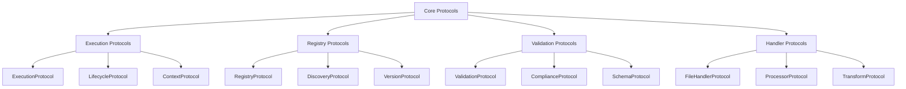

<!-- === OmniNode:Metadata ===
metadata_version: 0.1.0
protocol_version: 1.1.0
owner: OmniNode Team
copyright: OmniNode Team
schema_version: 1.1.0
name: reference-protocols-core.md
version: 1.0.0
uuid: edb0d034-a635-4908-97ad-063eae401aea
author: OmniNode Team
created_at: 2025-05-27T09:21:25.481393
last_modified_at: 2025-05-27T17:26:51.926636
description: Stamped by ONEX
state_contract: state_contract://default
lifecycle: active
hash: 75fcf2461ad71f540964fcd0e2534ff448a5337aeb9503cce52ab8c857d863d8
entrypoint: python@reference-protocols-core.md
runtime_language_hint: python>=3.11
namespace: onex.stamped.reference_protocols_core
meta_type: tool
<!-- === /OmniNode:Metadata === -->


# ONEX Core Protocols and Execution

> **Status:** Canonical  
> **Last Updated:** 2025-01-27  
> **Purpose:** Define core execution protocols and lifecycle management in the ONEX ecosystem  
> **Audience:** Developers, architects, system integrators  
> **See Also:** [Registry Protocols](reference-protocols-registry.md), [Data Models](reference-data-models.md)

---

## Overview

This document defines the core protocols for execution, lifecycle management, and context handling in the ONEX platform. These protocols form the foundation for all executable components and their interactions.

---

## Core Protocol Hierarchy

### Protocol Classification



### Protocol Design Principles

1. **Structural Typing**: Use Protocol classes for duck typing
2. **Minimal Interfaces**: Keep protocols focused and minimal
3. **Composability**: Protocols can be combined and extended
4. **Backward Compatibility**: Maintain compatibility across versions
5. **Clear Contracts**: Well-defined input/output specifications

---

## Execution Protocols

### ExecutionProtocol

```python
from typing import Protocol, Any, Dict, Optional, List
from dataclasses import dataclass
from enum import Enum

class ExecutionStatus(Enum):
    """Execution status enumeration."""
    PENDING = "pending"
    RUNNING = "running"
    SUCCESS = "success"
    FAILURE = "failure"
    TIMEOUT = "timeout"
    CANCELLED = "cancelled"

@dataclass
class ExecutionResult:
    """Result of an execution operation."""
    status: ExecutionStatus
    output: Optional[str] = None
    error: Optional[str] = None
    exit_code: Optional[int] = None
    duration_ms: Optional[int] = None
    metadata: Dict[str, Any] = None

class ExecutionProtocol(Protocol):
    """Protocol for executable components."""
    
    def execute(self, context: 'ExecutionContext') -> ExecutionResult:
        """Execute the component with given context.
        
        Args:
            context: Execution context with capabilities and environment
            
        Returns:
            Execution result with status and output
        """
        ...
    
    def validate_context(self, context: 'ExecutionContext') -> bool:
        """Validate that context meets execution requirements.
        
        Args:
            context: Execution context to validate
            
        Returns:
            True if context is valid for execution
        """
        ...
    
    def get_required_capabilities(self) -> List['Capability']:
        """Get list of required capabilities for execution.
        
        Returns:
            List of required capability objects
        """
        ...
```

### LifecycleProtocol

```python
from enum import Enum

class LifecycleState(Enum):
    """Component lifecycle states."""
    DRAFT = "draft"
    ACTIVE = "active"
    DEPRECATED = "deprecated"
    ARCHIVED = "archived"

class LifecycleProtocol(Protocol):
    """Protocol for lifecycle-aware components."""
    
    @property
    def lifecycle_state(self) -> LifecycleState:
        """Current lifecycle state."""
        ...
    
    def transition_to(self, new_state: LifecycleState) -> bool:
        """Transition to new lifecycle state.
        
        Args:
            new_state: Target lifecycle state
            
        Returns:
            True if transition was successful
        """
        ...
    
    def can_transition_to(self, new_state: LifecycleState) -> bool:
        """Check if transition to new state is allowed.
        
        Args:
            new_state: Target lifecycle state
            
        Returns:
            True if transition is allowed
        """
        ...
    
    def get_allowed_transitions(self) -> List[LifecycleState]:
        """Get list of allowed transition states.
        
        Returns:
            List of states that can be transitioned to
        """
        ...
```

### ContextProtocol

```python
from typing import Protocol, Dict, Any, List, Optional
from pathlib import Path

class ContextProtocol(Protocol):
    """Protocol for execution contexts."""
    
    @property
    def capabilities(self) -> List['Capability']:
        """Available capabilities in this context."""
        ...
    
    @property
    def environment(self) -> Dict[str, str]:
        """Environment variables."""
        ...
    
    @property
    def working_directory(self) -> Path:
        """Working directory for execution."""
        ...
    
    @property
    def timeout(self) -> Optional[int]:
        """Execution timeout in seconds."""
        ...
    
    def has_capability(self, capability: 'Capability') -> bool:
        """Check if context has specific capability.
        
        Args:
            capability: Capability to check
            
        Returns:
            True if capability is available
        """
        ...
    
    def get_secret(self, name: str) -> Optional[str]:
        """Get secret value by name.
        
        Args:
            name: Secret name
            
        Returns:
            Secret value if available, None otherwise
        """
        ...
```

---

## Protocol Composition

### Composite Protocols

```python
class NodeProtocol(ExecutionProtocol, LifecycleProtocol, ValidationProtocol, Protocol):
    """Composite protocol for ONEX nodes."""
    
    @property
    def metadata(self) -> 'NodeMetadata':
        """Node metadata."""
        ...
    
    def introspect(self) -> Dict[str, Any]:
        """Get node introspection information."""
        ...

class ValidatingExecutorProtocol(ExecutionProtocol, ValidationProtocol, Protocol):
    """Protocol for executors that validate before execution."""
    
    def validate_and_execute(self, context: 'ExecutionContext') -> ExecutionResult:
        """Validate context and execute if valid."""
        validation_result = self.validate(context)
        if not validation_result.success:
            return ExecutionResult(
                status=ExecutionStatus.FAILURE,
                error=f"Validation failed: {validation_result.issues}"
            )
        return self.execute(context)
```

### Protocol Adapters

```python
class ProtocolAdapter:
    """Base class for protocol adapters."""
    
    def __init__(self, adaptee: Any):
        self.adaptee = adaptee
    
    def supports_protocol(self, protocol_type: type) -> bool:
        """Check if adaptee supports protocol."""
        return isinstance(self.adaptee, protocol_type)

class ExecutionAdapter(ProtocolAdapter):
    """Adapter for ExecutionProtocol."""
    
    def execute(self, context: 'ExecutionContext') -> ExecutionResult:
        """Adapt execution call."""
        if hasattr(self.adaptee, 'run'):
            # Adapt 'run' method to 'execute'
            result = self.adaptee.run(context)
            return self._convert_result(result)
        elif hasattr(self.adaptee, '__call__'):
            # Adapt callable to execute
            result = self.adaptee(context)
            return self._convert_result(result)
        else:
            raise NotImplementedError("Adaptee does not support execution")
    
    def _convert_result(self, result: Any) -> ExecutionResult:
        """Convert result to ExecutionResult."""
        if isinstance(result, ExecutionResult):
            return result
        elif isinstance(result, bool):
            return ExecutionResult(
                status=ExecutionStatus.SUCCESS if result else ExecutionStatus.FAILURE
            )
        else:
            return ExecutionResult(
                status=ExecutionStatus.SUCCESS,
                output=str(result)
            )
```

---

## Execution Planning

### Execution Models

```python
@dataclass
class ExecutionStep:
    """Single execution step."""
    step_id: str
    node_name: str
    node_version: str
    parameters: Dict[str, Any]
    dependencies: List[str]  # step_ids this step depends on
    timeout: Optional[int] = None
    retry_count: int = 0
    
@dataclass
class ExecutionPlan:
    """Plan for executing multiple steps."""
    plan_id: str
    steps: List[ExecutionStep]
    execution_order: List[str]  # step_ids in execution order
    metadata: Dict[str, Any]
    
    def get_step(self, step_id: str) -> Optional[ExecutionStep]:
        """Get step by ID."""
        for step in self.steps:
            if step.step_id == step_id:
                return step
        return None
    
    def get_dependencies(self, step_id: str) -> List[ExecutionStep]:
        """Get dependencies for a step."""
        step = self.get_step(step_id)
        if not step:
            return []
        
        return [self.get_step(dep_id) for dep_id in step.dependencies 
                if self.get_step(dep_id) is not None]
```

---

## See Also

- [Registry Protocols](reference-protocols-registry.md) - Registry, discovery, and version protocols
- [Data Models](reference-data-models.md) - Data models, composition, and testing
- [Registry Protocols](./reference-protocols-registry.md) - Registry and validation protocols
- [Data Models](./reference-data-models.md) - Data models and composition
- [Execution Context](execution_context.md) - Execution context specification
- [Error Handling](error_handling.md) - Error handling patterns
