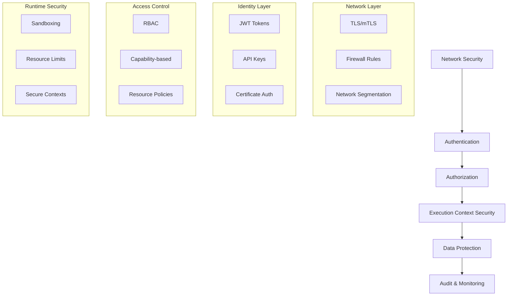
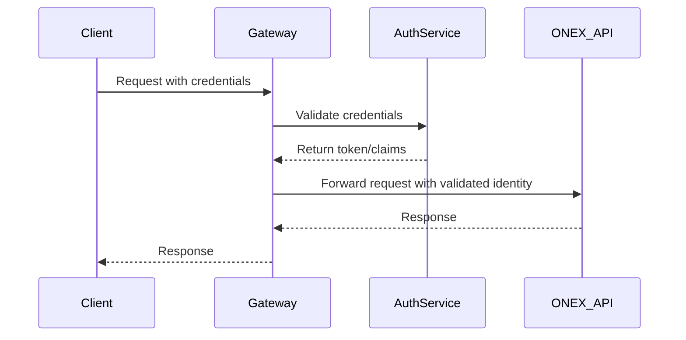

# ONEX Security Overview and Authentication

> **Status:** Canonical  
> **Last Updated:** 2025-01-27  
> **Purpose:** Security architecture overview and authentication protocols for the ONEX platform  
> **Audience:** Security engineers, developers, system administrators  
> **Enforcement:** All ONEX components must implement these security standards

---

## Overview

This document defines the security architecture and authentication protocols for the ONEX platform. All components, nodes, and infrastructure must implement these security standards to ensure a robust, secure, and trustworthy execution environment.

**See Also:**
- [Security Implementation Guide](guide-security-implementation.md) - Practical implementation details
- [Security Architecture Design](architecture-security-design.md) - Network security and monitoring

---

## Security Architecture

### Defense in Depth

The ONEX security model implements multiple layers of protection:



### Security Principles

1. **Zero Trust**: Never trust, always verify
2. **Least Privilege**: Grant minimal necessary permissions
3. **Defense in Depth**: Multiple security layers
4. **Fail Secure**: Default to secure state on failure
5. **Audit Everything**: Comprehensive logging and monitoring

---

## Authentication

### Supported Authentication Methods

#### JWT Token Authentication
```yaml
# JWT configuration
jwt:
  issuer: "https://auth.example.com"
  audience: "onex-api"
  algorithm: "RS256"
  public_key_url: "https://auth.example.com/.well-known/jwks.json"
  token_expiry: 3600  # 1 hour
  refresh_expiry: 86400  # 24 hours
```

#### API Key Authentication
```yaml
# API key configuration
api_keys:
  enabled: true
  header_name: "X-API-Key"
  key_length: 32
  expiry_days: 90
  rate_limit:
    requests_per_minute: 1000
    burst_limit: 100
```

#### Certificate-Based Authentication
```yaml
# mTLS configuration
mtls:
  enabled: true
  ca_cert_path: "/etc/ssl/ca/ca.crt"
  cert_path: "/etc/ssl/certs/client.crt"
  key_path: "/etc/ssl/private/client.key"
  verify_client: true
  cipher_suites:
    - "TLS_ECDHE_RSA_WITH_AES_256_GCM_SHA384"
    - "TLS_ECDHE_RSA_WITH_AES_128_GCM_SHA256"
```

### Authentication Implementation

```python
from typing import Optional, Dict, Any
from datetime import datetime, timedelta
import jwt
from cryptography.hazmat.primitives import hashes
from cryptography.hazmat.primitives.asymmetric import rsa

class AuthenticationService:
    """Centralized authentication service for ONEX platform."""
    
    def __init__(self, config: Dict[str, Any]):
        self.config = config
        self.jwt_config = config.get("jwt", {})
        self.api_key_config = config.get("api_keys", {})
    
    def validate_jwt_token(self, token: str) -> Optional[Dict[str, Any]]:
        """Validate JWT token and return claims.
        
        Args:
            token: JWT token string
            
        Returns:
            Token claims if valid, None otherwise
        """
        try:
            # Decode and validate token
            claims = jwt.decode(
                token,
                self._get_public_key(),
                algorithms=[self.jwt_config["algorithm"]],
                audience=self.jwt_config["audience"],
                issuer=self.jwt_config["issuer"]
            )
            
            # Additional validation
            if not self._validate_claims(claims):
                return None
                
            return claims
            
        except jwt.InvalidTokenError:
            return None
    
    def validate_api_key(self, api_key: str) -> Optional[Dict[str, Any]]:
        """Validate API key and return associated metadata.
        
        Args:
            api_key: API key string
            
        Returns:
            Key metadata if valid, None otherwise
        """
        # Implementation depends on storage backend
        # Could be database, Redis, etc.
        pass
    
    def generate_api_key(self, user_id: str, permissions: List[str]) -> str:
        """Generate new API key for user.
        
        Args:
            user_id: User identifier
            permissions: List of permissions for this key
            
        Returns:
            Generated API key
        """
        import secrets
        
        api_key = secrets.token_urlsafe(self.api_key_config["key_length"])
        
        # Store key metadata
        self._store_api_key_metadata(api_key, {
            "user_id": user_id,
            "permissions": permissions,
            "created_at": datetime.utcnow(),
            "expires_at": datetime.utcnow() + timedelta(
                days=self.api_key_config["expiry_days"]
            )
        })
        
        return api_key

    def _get_public_key(self) -> str:
        """Retrieve public key for JWT validation."""
        # Implementation to fetch public key from configured URL
        pass
    
    def _validate_claims(self, claims: Dict[str, Any]) -> bool:
        """Additional claim validation logic."""
        # Custom validation rules
        return True
    
    def _store_api_key_metadata(self, api_key: str, metadata: Dict[str, Any]) -> None:
        """Store API key metadata in backend storage."""
        # Implementation depends on storage backend
        pass
```

### Authentication Flow



### Token Management

#### Token Lifecycle
1. **Generation**: Create tokens with appropriate claims and expiry
2. **Validation**: Verify signature, expiry, and claims on each request
3. **Refresh**: Provide refresh mechanism for long-lived sessions
4. **Revocation**: Support immediate token invalidation when needed

#### Security Considerations
- Use strong cryptographic algorithms (RS256 minimum)
- Implement proper token expiry and refresh mechanisms
- Store sensitive keys securely (HSM, key vault)
- Log all authentication events for audit purposes
- Implement rate limiting to prevent brute force attacks

---

## See Also

- [Security Implementation Guide](guide-security-implementation.md) - Authorization, secrets management, and secure node execution
- [Security Architecture Design](architecture-security-design.md) - Network security, monitoring, and compliance
- [Error Handling Guide](error_handling.md) - Security error handling patterns
- [Monitoring Guide](monitoring.md) - Security monitoring and alerting 