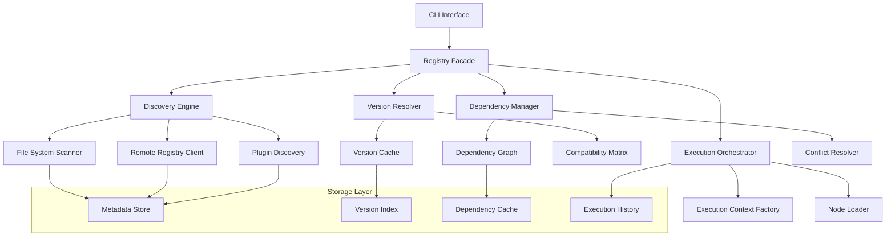

<!-- === OmniNode:Metadata ===
metadata_version: 0.1.0
protocol_version: 1.1.0
owner: OmniNode Team
copyright: OmniNode Team
schema_version: 1.1.0
name: registry_architecture.md
version: 1.0.0
uuid: 67461fb1-6f66-4ab1-bb5e-361805435b11
author: OmniNode Team
created_at: 2025-05-27T07:12:23.783542
last_modified_at: 2025-05-27T17:26:51.837494
description: Stamped by ONEX
state_contract: state_contract://default
lifecycle: active
hash: a88137e202fd4bb04b1b66d0a012981a22f646bce1b37f470ee9a32dd568a5b2
entrypoint: python@registry_architecture.md
runtime_language_hint: python>=3.11
namespace: onex.stamped.registry_architecture
meta_type: tool
<!-- === /OmniNode:Metadata === -->


# ONEX Registry Architecture

> **Status:** Canonical  
> **Last Updated:** 2025-01-27  
> **Purpose:** Define the architecture and implementation of the ONEX registry system  
> **Audience:** System architects, platform developers, registry maintainers  
> **Companion:** [Registry Specification](./registry.md), [Handler Protocols](./reference-handlers-protocol.md), [Handler Registry](./reference-handlers-registry.md)

---

## Overview

The ONEX Registry Architecture provides a comprehensive system for discovering, managing, and executing nodes within the ONEX ecosystem. The registry serves as the central coordination point for node lifecycle management, version resolution, dependency tracking, and execution orchestration.

---

## Architectural Principles

### Core Design Principles

1. **Decentralized Discovery**: Nodes can be discovered from multiple sources
2. **Version Resolution**: Automatic resolution of compatible versions
3. **Dependency Management**: Comprehensive dependency tracking and validation
4. **Lifecycle Awareness**: Full support for node lifecycle states
5. **Performance Optimization**: Efficient caching and indexing strategies
6. **Extensibility**: Pluggable registry backends and discovery mechanisms

### Registry Responsibilities

- **Node Discovery**: Locate and catalog available nodes
- **Version Management**: Track and resolve node versions
- **Dependency Resolution**: Manage node dependencies and conflicts
- **Metadata Management**: Store and retrieve node metadata
- **Execution Coordination**: Orchestrate node execution workflows
- **Lifecycle Management**: Track node lifecycle states and transitions

---

## System Architecture

### High-Level Architecture



### Component Responsibilities

| Component | Responsibility | Key Features |
|-----------|---------------|--------------|
| **Registry Facade** | Main interface for registry operations | Unified API, request routing, caching |
| **Discovery Engine** | Node discovery and cataloging | Multi-source discovery, metadata extraction |
| **Version Resolver** | Version compatibility and resolution | Semantic versioning, constraint solving |
| **Dependency Manager** | Dependency tracking and resolution | Graph analysis, conflict detection |
| **Execution Orchestrator** | Node execution coordination | Context management, lifecycle tracking |

---

## Discovery Architecture

### Discovery Sources

#### File System Discovery

```python
class FileSystemDiscovery:
    """Discovers nodes from local file system."""
    
    def __init__(self, search_paths: List[Path]):
        self.search_paths = search_paths
        self.metadata_cache = {}
    
    def discover_nodes(self) -> List[NodeMetadata]:
        """Discover nodes from file system."""
        discovered_nodes = []
        
        for search_path in self.search_paths:
            nodes = self._scan_directory(search_path)
            discovered_nodes.extend(nodes)
        
        return discovered_nodes
    
    def _scan_directory(self, directory: Path) -> List[NodeMetadata]:
        """Scan directory for node metadata files."""
        nodes = []
        
        # Look for .onex.yaml files
        for metadata_file in directory.rglob("*.onex.yaml"):
            try:
                metadata = self._parse_metadata_file(metadata_file)
                if self._validate_metadata(metadata):
                    nodes.append(metadata)
            except Exception as e:
                logger.warning(f"Failed to parse {metadata_file}: {e}")
        
        return nodes
```

#### Remote Registry Discovery

```python
class RemoteRegistryDiscovery:
    """Discovers nodes from remote registries."""
    
    def __init__(self, registry_urls: List[str]):
        self.registry_urls = registry_urls
        self.client = RegistryClient()
    
    def discover_nodes(self) -> List[NodeMetadata]:
        """Discover nodes from remote registries."""
        discovered_nodes = []
        
        for registry_url in self.registry_urls:
            try:
                nodes = self.client.list_nodes(registry_url)
                discovered_nodes.extend(nodes)
            except Exception as e:
                logger.warning(f"Failed to discover from {registry_url}: {e}")
        
        return discovered_nodes
```

#### Plugin Discovery

```python
class PluginDiscovery:
    """Discovers nodes from installed plugins."""
    
    def discover_nodes(self) -> List[NodeMetadata]:
        """Discover nodes from entry points."""
        discovered_nodes = []
        
        # Discover from setuptools entry points
        for entry_point in pkg_resources.iter_entry_points('onex.nodes'):
            try:
                node_class = entry_point.load()
                metadata = self._extract_metadata(node_class)
                discovered_nodes.append(metadata)
            except Exception as e:
                logger.warning(f"Failed to load plugin {entry_point.name}: {e}")
        
        return discovered_nodes
```

### Discovery Coordination

```python
class DiscoveryEngine:
    """Coordinates discovery from multiple sources."""
    
    def __init__(self):
        self.discovery_sources = []
        self.metadata_store = MetadataStore()
        self.discovery_cache = DiscoveryCache()
    
    def register_discovery_source(self, source: DiscoverySource) -> None:
        """Register a discovery source."""
        self.discovery_sources.append(source)
    
    def discover_all_nodes(self, force_refresh: bool = False) -> List[NodeMetadata]:
        """Discover nodes from all sources."""
        if not force_refresh and self.discovery_cache.is_valid():
            return self.discovery_cache.get_cached_nodes()
        
        all_nodes = []
        
        for source in self.discovery_sources:
            try:
                nodes = source.discover_nodes()
                all_nodes.extend(nodes)
            except Exception as e:
                logger.error(f"Discovery source failed: {e}")
        
        # Deduplicate and merge metadata
        unique_nodes = self._deduplicate_nodes(all_nodes)
        
        # Update cache
        self.discovery_cache.update_cache(unique_nodes)
        
        return unique_nodes
```

---

## Version Resolution Architecture

### Version Resolution Strategy

```python
class VersionResolver:
    """Resolves node versions based on constraints."""
    
    def __init__(self):
        self.version_cache = VersionCache()
        self.compatibility_matrix = CompatibilityMatrix()
    
    def resolve_version(
        self, 
        node_name: str, 
        version_constraint: str = "latest"
    ) -> Optional[Version]:
        """Resolve version constraint to concrete version."""
        
        # Check cache first
        cache_key = f"{node_name}:{version_constraint}"
        if cached_version := self.version_cache.get(cache_key):
            return cached_version
        
        # Get available versions
        available_versions = self._get_available_versions(node_name)
        if not available_versions:
            return None
        
        # Resolve constraint
        resolved_version = self._resolve_constraint(
            version_constraint, 
            available_versions
        )
        
        # Cache result
        if resolved_version:
            self.version_cache.set(cache_key, resolved_version)
        
        return resolved_version
    
    def _resolve_constraint(
        self, 
        constraint: str, 
        available_versions: List[Version]
    ) -> Optional[Version]:
        """Resolve version constraint against available versions."""
        
        if constraint == "latest":
            return max(available_versions)
        
        if constraint.startswith("^"):
            # Compatible version constraint
            base_version = Version.parse(constraint[1:])
            compatible_versions = [
                v for v in available_versions 
                if self._is_compatible(base_version, v)
            ]
            return max(compatible_versions) if compatible_versions else None
        
        if constraint.startswith("~"):
            # Patch-level constraint
            base_version = Version.parse(constraint[1:])
            patch_versions = [
                v for v in available_versions 
                if self._is_patch_compatible(base_version, v)
            ]
            return max(patch_versions) if patch_versions else None
        
        # Exact version
        try:
            exact_version = Version.parse(constraint)
            return exact_version if exact_version in available_versions else None
        except ValueError:
            return None
```

### Dependency Resolution

```python
class DependencyResolver:
    """Resolves node dependencies and detects conflicts."""
    
    def __init__(self):
        self.dependency_graph = DependencyGraph()
        self.conflict_resolver = ConflictResolver()
    
    def resolve_dependencies(
        self, 
        root_nodes: List[NodeMetadata]
    ) -> DependencyResolution:
        """Resolve dependencies for a set of root nodes."""
        
        # Build dependency graph
        graph = self._build_dependency_graph(root_nodes)
        
        # Detect cycles
        cycles = self._detect_cycles(graph)
        if cycles:
            return DependencyResolution(
                success=False,
                error=f"Circular dependencies detected: {cycles}"
            )
        
        # Resolve version conflicts
        resolution = self._resolve_version_conflicts(graph)
        if not resolution.success:
            return resolution
        
        # Generate execution order
        execution_order = self._topological_sort(graph)
        
        return DependencyResolution(
            success=True,
            resolved_nodes=resolution.resolved_nodes,
            execution_order=execution_order
        )
    
    def _build_dependency_graph(
        self, 
        root_nodes: List[NodeMetadata]
    ) -> DependencyGraph:
        """Build dependency graph from root nodes."""
        graph = DependencyGraph()
        visited = set()
        
        def visit_node(node: NodeMetadata):
            if node.uuid in visited:
                return
            
            visited.add(node.uuid)
            graph.add_node(node)
            
            for dependency in node.dependencies:
                dep_node = self._resolve_dependency(dependency)
                if dep_node:
                    graph.add_edge(node.uuid, dep_node.uuid)
                    visit_node(dep_node)
        
        for root_node in root_nodes:
            visit_node(root_node)
        
        return graph
```

---

## Storage Architecture

### Metadata Storage

```python
class MetadataStore:
    """Persistent storage for node metadata."""
    
    def __init__(self, storage_backend: StorageBackend):
        self.backend = storage_backend
        self.indexes = {
            'name': NameIndex(),
            'version': VersionIndex(),
            'tags': TagIndex(),
            'capabilities': CapabilityIndex()
        }
    
    def store_metadata(self, metadata: NodeMetadata) -> bool:
        """Store node metadata."""
        try:
            # Store in backend
            self.backend.store(metadata.uuid, metadata.to_dict())
            
            # Update indexes
            for index in self.indexes.values():
                index.update(metadata)
            
            return True
        except Exception as e:
            logger.error(f"Failed to store metadata: {e}")
            return False
    
    def query_metadata(self, query: MetadataQuery) -> List[NodeMetadata]:
        """Query metadata using indexes."""
        # Use appropriate index for query
        if query.name_pattern:
            candidates = self.indexes['name'].search(query.name_pattern)
        elif query.tags:
            candidates = self.indexes['tags'].search(query.tags)
        elif query.capabilities:
            candidates = self.indexes['capabilities'].search(query.capabilities)
        else:
            candidates = self._get_all_metadata()
        
        # Apply additional filters
        results = []
        for metadata in candidates:
            if self._matches_query(metadata, query):
                results.append(metadata)
        
        return results
```

### Caching Strategy

```python
class RegistryCache:
    """Multi-level caching for registry operations."""
    
    def __init__(self):
        self.l1_cache = LRUCache(maxsize=1000)  # In-memory
        self.l2_cache = RedisCache()            # Distributed
        self.l3_cache = FileCache()             # Persistent
    
    def get(self, key: str) -> Optional[Any]:
        """Get value from cache hierarchy."""
        # Try L1 cache first
        if value := self.l1_cache.get(key):
            return value
        
        # Try L2 cache
        if value := self.l2_cache.get(key):
            self.l1_cache.set(key, value)
            return value
        
        # Try L3 cache
        if value := self.l3_cache.get(key):
            self.l1_cache.set(key, value)
            self.l2_cache.set(key, value)
            return value
        
        return None
    
    def set(self, key: str, value: Any, ttl: Optional[int] = None) -> None:
        """Set value in all cache levels."""
        self.l1_cache.set(key, value)
        self.l2_cache.set(key, value, ttl=ttl)
        self.l3_cache.set(key, value, ttl=ttl)
    
    def invalidate(self, pattern: str) -> None:
        """Invalidate cache entries matching pattern."""
        self.l1_cache.invalidate(pattern)
        self.l2_cache.invalidate(pattern)
        self.l3_cache.invalidate(pattern)
```

---

## Execution Architecture

### Execution Orchestration

```python
class ExecutionOrchestrator:
    """Orchestrates node execution workflows."""
    
    def __init__(self):
        self.context_factory = ExecutionContextFactory()
        self.node_loader = NodeLoader()
        self.execution_tracker = ExecutionTracker()
    
    def execute_workflow(
        self, 
        workflow: ExecutionWorkflow
    ) -> ExecutionResult:
        """Execute a workflow of nodes."""
        
        # Validate workflow
        validation_result = self._validate_workflow(workflow)
        if not validation_result.success:
            return ExecutionResult(
                success=False,
                error=f"Workflow validation failed: {validation_result.error}"
            )
        
        # Create execution context
        context = self.context_factory.create_context(workflow.context_spec)
        
        # Execute nodes in dependency order
        results = {}
        for node_spec in workflow.execution_order:
            try:
                # Load node
                node = self.node_loader.load_node(node_spec)
                
                # Execute node
                node_result = self._execute_node(node, context, results)
                results[node_spec.uuid] = node_result
                
                # Track execution
                self.execution_tracker.record_execution(
                    node_spec.uuid, 
                    node_result
                )
                
                # Check for failure
                if not node_result.success and workflow.fail_fast:
                    return ExecutionResult(
                        success=False,
                        error=f"Node {node_spec.name} failed: {node_result.error}",
                        partial_results=results
                    )
                    
            except Exception as e:
                error_msg = f"Failed to execute node {node_spec.name}: {e}"
                logger.error(error_msg)
                
                if workflow.fail_fast:
                    return ExecutionResult(
                        success=False,
                        error=error_msg,
                        partial_results=results
                    )
        
        return ExecutionResult(
            success=True,
            results=results
        )
```

### Node Loading

```python
class NodeLoader:
    """Loads and instantiates nodes for execution."""
    
    def __init__(self):
        self.loader_cache = LoaderCache()
        self.security_validator = SecurityValidator()
    
    def load_node(self, node_spec: NodeSpec) -> ExecutableNode:
        """Load node from specification."""
        
        # Check cache first
        cache_key = f"{node_spec.uuid}:{node_spec.version}"
        if cached_node := self.loader_cache.get(cache_key):
            return cached_node
        
        # Validate security
        if not self.security_validator.validate_node(node_spec):
            raise SecurityError(f"Node {node_spec.name} failed security validation")
        
        # Load node implementation
        node_impl = self._load_node_implementation(node_spec)
        
        # Wrap in executable interface
        executable_node = ExecutableNodeWrapper(node_impl, node_spec)
        
        # Cache loaded node
        self.loader_cache.set(cache_key, executable_node)
        
        return executable_node
    
    def _load_node_implementation(self, node_spec: NodeSpec) -> Any:
        """Load the actual node implementation."""
        
        if node_spec.source_type == "file":
            return self._load_from_file(node_spec.source_path)
        elif node_spec.source_type == "package":
            return self._load_from_package(node_spec.package_name)
        elif node_spec.source_type == "remote":
            return self._load_from_remote(node_spec.remote_url)
        else:
            raise ValueError(f"Unknown source type: {node_spec.source_type}")
```

---

## Performance Considerations

### Optimization Strategies

#### Discovery Optimization

- **Incremental Discovery**: Only scan changed directories
- **Parallel Discovery**: Discover from multiple sources concurrently
- **Smart Caching**: Cache discovery results with invalidation
- **Index Optimization**: Maintain efficient search indexes

#### Version Resolution Optimization

- **Resolution Caching**: Cache resolved versions
- **Constraint Preprocessing**: Optimize constraint parsing
- **Compatibility Matrix**: Precompute compatibility relationships
- **Lazy Loading**: Load version information on demand

#### Execution Optimization

- **Node Preloading**: Preload frequently used nodes
- **Context Reuse**: Reuse execution contexts when possible
- **Parallel Execution**: Execute independent nodes in parallel
- **Resource Pooling**: Pool expensive resources

### Performance Metrics

```yaml
performance_targets:
  discovery:
    initial_scan: "< 5s for 1000 nodes"
    incremental_scan: "< 1s for 100 changed nodes"
    cache_hit_ratio: "> 90%"
  
  version_resolution:
    simple_resolution: "< 10ms"
    complex_resolution: "< 100ms"
    cache_hit_ratio: "> 95%"
  
  execution:
    node_loading: "< 50ms per node"
    context_creation: "< 20ms"
    orchestration_overhead: "< 5% of total execution time"
```

---

## Security Architecture

### Security Layers

#### Registry Security

- **Metadata Validation**: Validate all metadata before storage
- **Source Authentication**: Verify discovery source authenticity
- **Access Control**: Control access to registry operations
- **Audit Logging**: Log all registry modifications

#### Execution Security

- **Node Validation**: Validate nodes before execution
- **Capability Enforcement**: Enforce execution capabilities
- **Resource Limits**: Limit node resource usage
- **Isolation**: Isolate node execution environments

### Security Implementation

```python
class RegistrySecurity:
    """Security enforcement for registry operations."""
    
    def __init__(self):
        self.validator = MetadataValidator()
        self.authenticator = SourceAuthenticator()
        self.auditor = AuditLogger()
    
    def validate_registration(
        self, 
        metadata: NodeMetadata, 
        source: DiscoverySource
    ) -> SecurityResult:
        """Validate node registration request."""
        
        # Validate metadata
        validation_result = self.validator.validate(metadata)
        if not validation_result.success:
            return SecurityResult(
                allowed=False,
                reason="Metadata validation failed"
            )
        
        # Authenticate source
        auth_result = self.authenticator.authenticate(source)
        if not auth_result.success:
            return SecurityResult(
                allowed=False,
                reason="Source authentication failed"
            )
        
        # Log registration attempt
        self.auditor.log_registration_attempt(metadata, source, True)
        
        return SecurityResult(allowed=True)
```

---

## Monitoring and Observability

### Registry Metrics

```python
class RegistryMetrics:
    """Metrics collection for registry operations."""
    
    def __init__(self):
        self.metrics_collector = MetricsCollector()
    
    def record_discovery_operation(
        self, 
        source: str, 
        duration: float, 
        nodes_found: int
    ) -> None:
        """Record discovery operation metrics."""
        self.metrics_collector.histogram(
            "registry_discovery_duration_seconds",
            duration,
            labels={"source": source}
        )
        
        self.metrics_collector.gauge(
            "registry_nodes_discovered",
            nodes_found,
            labels={"source": source}
        )
    
    def record_version_resolution(
        self, 
        node_name: str, 
        duration: float, 
        cache_hit: bool
    ) -> None:
        """Record version resolution metrics."""
        self.metrics_collector.histogram(
            "registry_version_resolution_duration_seconds",
            duration,
            labels={"node": node_name, "cache_hit": str(cache_hit)}
        )
```

### Health Checks

```python
class RegistryHealthCheck:
    """Health monitoring for registry components."""
    
    def check_discovery_sources(self) -> HealthStatus:
        """Check health of discovery sources."""
        unhealthy_sources = []
        
        for source in self.discovery_sources:
            try:
                source.health_check()
            except Exception as e:
                unhealthy_sources.append(f"{source.name}: {e}")
        
        if unhealthy_sources:
            return HealthStatus(
                healthy=False,
                message=f"Unhealthy sources: {unhealthy_sources}"
            )
        
        return HealthStatus(healthy=True)
    
    def check_storage_backend(self) -> HealthStatus:
        """Check health of storage backend."""
        try:
            self.metadata_store.health_check()
            return HealthStatus(healthy=True)
        except Exception as e:
            return HealthStatus(
                healthy=False,
                message=f"Storage backend unhealthy: {e}"
            )
```

---

## References

- [Registry Specification](./registry.md)
- [Handler Protocols](./reference-handlers-protocol.md)
- [Handler Registry](./reference-handlers-registry.md)
- [Handler Implementation](./guide-handlers-implementation.md)
- [Execution Context](./execution_context.md)
- [Security Overview](./reference-security-overview.md)
- [Monitoring Specification](./monitoring.md)

---

**Note:** The Registry Architecture is designed to be highly scalable and extensible. All components follow the protocol-based design patterns established in the ONEX ecosystem, ensuring consistency and interoperability across the platform.
